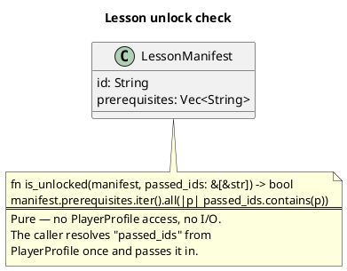
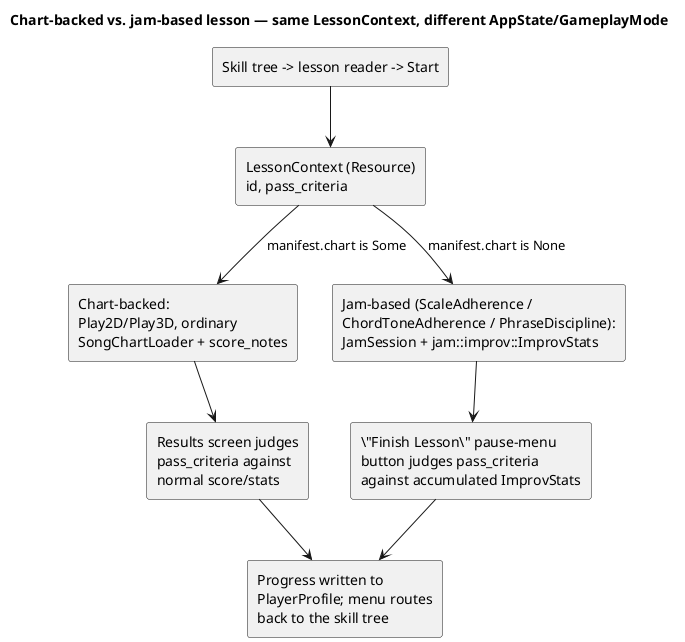
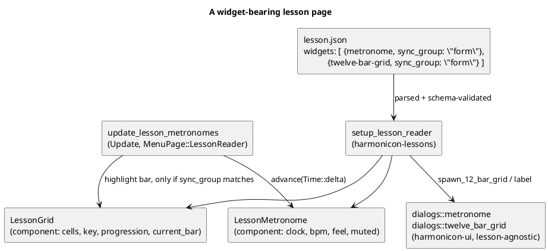

# The Lessons Engine

Harmonicon's guided curriculum: a hundred lessons across seventeen units,
gated by prerequisites, drawn as a skill tree, each judged by one of a
small closed set of pass criteria, with progress persisted per player.

**It spans two crates, and the split is the point.** The *data layer* —
manifest schema, the prerequisite graph, unit gates, discovery, progress
judgment — lives in `harmonicon-song`'s `lessons` module and is pure,
Bevy-free and densely unit-tested. The *presentation* — the skill tree,
its layout engine, the lesson reader and its embedded teaching aids —
lives in `harmonicon-lessons`, a feature crate sitting above
`harmonicon-menu`. Nothing in the data layer knows a node has a colour;
nothing in the UI crate decides whether a lesson is unlocked.

This chapter covers the manifest format, how a lesson actually *runs*
(mostly by reusing the ordinary gameplay pipeline, with one deliberate
exception), how the curriculum is drawn, and how discovery works for both
bundled and player-dropped lesson content.

## `LessonManifest`: the authored content

A lesson is a `lesson.json` file (`assets/lessons/<unit>/<lesson>/`,
schema-validated against `assets/lesson_schema.dtd.json`) with a stable
`id` — referenced by other lessons' `prerequisites` and by
`PlayerProfile`'s progress records, so ids are never meant to change once
published.

Validation is real, not advisory: `manifest::parse_lesson` runs the
embedded JSON Schema over the file *before* deserializing, so an
unsupported field or an out-of-range threshold is rejected at load with a
path-qualified error rather than silently defaulting. The compiled
validator is a process-wide `OnceLock` — the startup scan validates every
bundled and external lesson in a row, and recompiling the schema for each
was the expensive half.

| Field | Meaning |
|---|---|
| `id` | Stable, unique, never renamed once shipped. |
| `unit` | Which unit groups it. Displayed via `lesson-unit-<unit>`. |
| `title_key` / `body_key` | Fluent message **keys**, never raw text. |
| `optional` | An elective. Keeps its own prerequisites, but never counts toward a unit gate or blocks the required course. |
| `track` | Which skill row it belongs to, for tree colouring. Optional — read it through `LessonManifest::track()`, which falls back to `unit`. |
| `chart` | A `.harpchart` relative to the lesson's own directory. Absent = instructional-only. |
| `aural` | Hides the scrolling note prompts for an ear-training run; the synthesized call still plays and scoring is unchanged. |
| `prerequisites` | Lesson ids that must be passed first. |
| `pass_criteria` | A small closed enum — see below. Absent means finishing counts. |
| `training` | A `TrainingBlock` (technique, holes, optional seed) the five-tier drill ladder is generated from. |
| `progression` / `scale` / `position_cycle` | Seeds for a jam-based lesson's backing and live feedback. |
| `widgets` | Teaching aids embedded in the reader page — see below. |
| `diagram` | The original single-diagram field, kept only as a compatibility input for externally authored lessons. |

**`title_key`/`body_key` being keys is a hard rule, not a style
preference.** It's what lets a lesson's text be properly localized, and it
means the Song Editor's own lesson-authoring UI (see
[The Song Editor](song-editor-architecture.md)) can never accidentally
write real display text into a manifest — `serialize_lesson` derives the
keys from the lesson id and prints the key/text pairs to add by hand to
the locale files, the same manual step every bundled lesson's authoring
already requires.

`pass_criteria` is a closed enum rather than open-ended scripting:
`Accuracy { threshold }`, `Technique { technique, threshold }`, or one of
three jam-based criteria (`ScaleAdherence`, `ChordToneAdherence`,
`PhraseDiscipline`) for open improvisation lessons with no fixed notes to
score. Adding a sixth means a variant here, an arm in `lessons::progress`,
and a `oneOf` branch in the schema — deliberately three places, because a
criterion the player can fail should not be addable by accident.

## Prerequisite gating is a pure function

`is_unlocked` takes the manifest and an already-resolved list of passed
lesson ids — it doesn't reach into `PlayerProfile` itself. This keeps it
trivially unit-testable against plain data (see
[Testing Strategy](testing-strategy.md)) and, more importantly, keeps
`lessons::manifest` ignorant of how progress is actually stored — the
same "low-level module doesn't depend on the higher-level thing that
uses it" direction this codebase applies consistently (see
[Module Boundaries and Dependency Rules](module-dependency-rules.md)).

`lessons::graph` treats those same edges as a *graph* — depth, ordering,
and a build-time refusal to construct at all if they contain a cycle or
name a lesson that doesn't exist. A cycle is fatal twice over: a lesson
inside one can never unlock, and a renderer walking the edges would not
terminate, so `LessonGraph::build` returns an error rather than something
unusable.

## Units: the second, coarser gate

`lessons::units` is the other level. A unit opens once
`UNIT_UNLOCK_THRESHOLD` (0.7) of the previous unit's *non-elective*
lessons are passed — **deliberately not all of them**, so one lesson a
player stalls on (deep bends, most often) can't wall off the rest of the
course, while a completionist still has something to come back for.

Nothing extra is authored for this. A unit's identity is
`LessonManifest::unit`, its order is the order the catalog scan
discovered it in (sorted by the `01_`/`02_` directory prefixes), and its
display name is the `lesson-unit-<id>` Fluent key. There is no
`unit.json`, and adding one would mean a second build-script manifest for
wasm/Android to carry.

**Gating on unit order is only safe because that order is a valid
layering of the prerequisite graph.** Measured over the shipped
curriculum, every cross-unit prerequisite points forward, so a unit gate
can never contradict a lesson's own prerequisites or deadlock the player.
`units::crossing_prerequisites` reports any that don't and
`tests/asset_layout.rs` fails the build over one — this is checked, not
assumed, because authoring a backward edge is an easy mistake and an
undiagnosable one at runtime.

## Running a lesson: mostly the ordinary pipeline, with one exception

**A chart-backed lesson plays through the exact same pipeline as an
ordinary song** — `Play2D`/`Play3D`, the same `SongChartLoader`, the
same `score_notes`. There is no lesson-specific scoring path. What
changes is layered on top, via a `LessonContext` resource kept in flight
for the run's duration: the results screen judges `pass_criteria`
against it instead of (or alongside) recording an ordinary song-best,
adaptive difficulty is forced off (a lesson's own pacing shouldn't be
further modulated by a second, unrelated pacing system — see
[Application States and Modes](app-states.md) for the general
routing-flag pattern `LessonContext` follows for "where do I land when
this run ends"), and the menu routes back to the skill tree rather than
the song list on exit.

**The one exception**: `PassCriteria::ScaleAdherence`/
`ChordToneAdherence`/`PhraseDiscipline` have no chart notes to score at
all — they're an open `GameplayMode::JamSession` run judged on live
adherence data `jam::improv::ImprovStats` was already accumulating
continuously (see [Jam Session](jam-session-architecture.md)), with a
dedicated "Finish Lesson" pause-menu button (visible only when a
`LessonContext` is in flight during a jam) that judges the accumulated
stats on demand, since there's no natural chart end to trigger judging
automatically the way a scored song has.

## The training ladder: generated, not authored

A lesson teaches; a *training* presents the same material again, harder,
with no explanation. Five tiers (`harmonicon_core::training::Tier` —
Isolate, Consolidate, Vary, InContext, Interleave) across the lessons
that declare a `training` block would be far too many charts to author by
hand, so a training is a `DrillSpec` **rendered to a `HarpChart` on
demand** rather than a file on disk. `harmonicon-core` owns this because
a drill has to be reachable from `harmonicon-song`, which sits below the
crates that would otherwise be the natural home.

The ladder's shape is fixed, so a manifest only says *what* to drill and
*where* (technique, holes) — never how hard, which is the tier's job.
Generation is deterministic on a seed derived from the lesson id when the
author supplies none: a player re-attempting tier 3 must get the same
exercise, or a failed attempt and its retry aren't comparable and the
tier's threshold means nothing.

## Teaching aids: the `widgets` array

A reader page can embed interactive teaching aids below the lesson body.
`LessonWidget` is a `#[serde(tag = "type")]` enum with a matching `oneOf`
in the schema, so an unsupported widget kind **fails while loading the
manifest** rather than silently rendering an incomplete lesson — the same
"reject at parse time" stance the rest of the schema takes.

| Widget | Fields | Controls the reader spawns |
|---|---|---|
| `circle-of-fifths` | `harp_key`, `positions` | Step the reference harp key down/up a semitone, respawning the diagram |
| `twelve-bar-grid` | `key`, `progression`, `sync_group` | Step the highlighted bar back/forward, reset to bar 1 |
| `metronome` | `bpm`, `beats_per_bar`, `feel`, `sync_group` | Start/stop, ±5 BPM, straight/shuffle, mute |

**Every widget renders through `harmonicon-ui`, not through
`harmonicon-lessons`.** `dialogs::circle_of_fifths`,
`dialogs::twelve_bar_grid` and `dialogs::metronome` are lesson-agnostic —
they take a key, a progression, an elapsed time, and know nothing about
curricula. That's this codebase's standing rule for reusable widgets, and
it paid off immediately: the 12-bar grid and the metronome timing model
were *extracted from* gameplay's own `twelve_bar_blues_overlay` and
`metronome_overlay`, which now call the shared versions, rather than
being written twice.

`dialogs::metronome` is the interesting one, because it is deliberately
**clock-independent**: `MetronomeClock::advance(delta, bpm, feel)` takes
elapsed seconds from whatever caller owns time and returns the
subdivision tick that just elapsed, if any. Gameplay drives it from the
song clock (see [The Gameplay Clock](gameplay-clock.md)); the lesson
reader drives it from `Time::delta_secs_f64`, since a reader page has no
song and no transport. `click_for_tick` and `twelve_bar_for_tick` turn a
tick into accent/gain and a bar index, and all of it is `const fn` and
unit-tested without a `World`.

**`sync_group` is how a grid follows a metronome.** Both widgets take an
optional group name; `update_lesson_metronomes` advances a grid's
highlight only when the grid's `sync_group` is `Some` *and* equal to the
metronome's. A grid with no group is therefore manual-only — the
player steps it with the bar buttons — which is exactly what a lesson
that teaches the *shape* of the form wants, while a lesson teaching the
form *in time* declares the same group on both and the highlight walks
itself.

Metronome clicks are ordinary `AudioPlayer` entities tagged
`LessonMetronomeAudio` and despawned wholesale on `OnExit` — leaving the
page must not leave a click running, and tying the sounds to a marker
rather than to the widget entity means that holds even if a click is
in flight when the page tears down.

## The skill tree

`lesson_tree` draws the curriculum. It is split the same way the notation
staff is: **`layout.rs` decides, `mod.rs` translates.** Layout is pure —
no Bevy, no assets, no pixels — and answers which column, which row,
locked or not, how much of the ladder is done, in *grid* coordinates.
Node size and spacing are the renderer's business and change with the
theme; which node sits left of which does not.

**Two levels, not one.** Across the top runs a spine of unit nodes, each
opening once enough of the one before it is passed. Under each hangs that
unit's own lessons as their own small layered graph: row is depth within
the unit, column is chosen to keep edges untangled (four down-and-up
crossing-reduction sweeps, run once), and track is *colour* rather than
row.

**That two-level shape is the whole reason the drawing is readable.**
Laid out as one flat graph, the curriculum's cross-unit prerequisites
became edges spanning four and five columns, drawn straight through
whatever nodes and labels lay between — and no amount of crossing
reduction helps, because the endpoints are genuinely that far apart.
Grouping by unit turns all of them into a handful of spine edges, and
every remaining edge is local to one cluster.

**A cross-unit prerequisite is therefore not drawn at all.** It isn't
lost: `PlacedNode::unmet` carries whatever a locked lesson is still
waiting on, so the renderer names it on the node itself rather than make
the player trace a line across the screen.

### Edges are a shader, not a rotated rectangle

`bevy_ui` clips a node by pushing its four transformed corners inside the
clip rect — correct for an axis-aligned quad, but on a rotated one it
*shears* the quad rather than cutting it. The tree lives in a scroll
area, which clips, so every edge running off the viewport came out
skewed. `edges.rs` keeps the node axis-aligned and draws the line in a
`UiMaterial` fragment shader (`assets/shaders/lesson_edge.wgsl`),
putting clipping back on the path `bevy_ui` handles properly. Same
"custom shader for a shape a plain `Node` can't express" pattern as
`gameplay::note_tail_2d` and `music_score::tie_material`.

**The material carries no endpoints.** A node *is* its segment's bounding
box, padded by the half-thickness, and a segment always spans that box
corner to corner — so the shader rebuilds both ends from the node's size
and only needs telling which diagonal. Two consequences worth having: a
node that stretches still draws the right line (so a sliding unit needs
no material update), and every edge sharing a thickness, colour and
diagonal shares one material handle instead of one per edge.

### Collapse, compaction and viewport

`transition.rs` owns everything that moves. Units collapse and expand
(`CollapsedUnits`, `UnitExpansions`), finished units compact themselves
(`PendingCompaction`), neighbouring units slide to take up the freed
space (`UnitSlides`, `PreviousUnitPositions`), and the scroll position is
preserved across all of it (`PendingViewportAnchor`, `LessonTreeViewport`)
so returning from a lesson lands you where you left rather than back at
Unit 1. `PendingLessonFocus` is the other half of that: it scrolls a
specific lesson into view, which is what makes "take me to the next
thing I can do" land somewhere useful on a tree far wider than the
window.

These systems are `.chain()`ed in `LessonsUiPlugin` and run only under
`MenuPage::LessonTree`. The order matters — an animation frame that
compacted before it restored the anchor would restore the wrong
position — which is why they're a chain rather than seven independent
systems.

Panning is not tree-specific: `dialogs::scroll_area`'s `drag_to_pan`
gives *every* scroll area in the game drag panning, because touch has no
wheel and a 10px scrollbar thumb is not a touch target. Telling a tap
from the start of a swipe is handled there too, and is subtler than it
looks: Bevy emits `DragStart` on the first nonzero movement — ordinary
finger jitter — and dispatches `Click` *before* `DragEnd` on release, so
a swipe that began over a lesson node would otherwise open that lesson.
The fix is a `PAN_SLOP_PX` threshold (8px) and, only once it's crossed,
removing `Pressed` from the button the gesture started on. Jitter keeps
the tap alive; a real swipe cannot activate what it began over.

## Discovery: bundled plus external, kept live

`lessons::catalog::scan_all_lessons` scans `assets/lessons` and then, if
present, `~/Harmonicon/lessons` — bundled entries first, so a
player-dropped lesson can never silently reorder or shadow shipped
curriculum. This mirrors `assets_management`'s own bundled-plus-external
pattern for songs and themes exactly (see [Persistence](persistence.md)
for the shared live-filesystem-watcher infrastructure both ride on) —
deliberately: `lessons` depends on `assets_management` for the low-level
watch machinery, never the other way around, since `assets_management`
is generic shared vocabulary that has no business knowing what a
"lesson" is. A live drop-in under `~/Harmonicon/lessons` fires a
`LessonsRescanned` message the skill-tree page consumes to rebuild
itself if it happens to already be open — no restart, no manual refresh
button.

An invalid manifest is logged and skipped, never fatal. One bad lesson
should cost that lesson, not the whole curriculum.

**On wasm and Android there is no directory to scan**, so `catalog` is
two `#[cfg]`-gated implementations of the same function — see
[Native vs. WebAssembly](cross-platform-wasm.md). Lessons need a
*different* manifest from the one `assets_management` generates, because
`catalog` reads each `lesson.json`'s bytes directly instead of going
through `AssetServer`: `crates/harmonicon-song/build.rs` embeds the JSON
*text* with `include_str!` rather than just directory names, and has to
be its own build script for the same per-package `OUT_DIR` reason the
platform one does. There is no manifest-backed equivalent of the
`~/Harmonicon` folder, and there shouldn't be — a browser has no home
directory and an Android app can only reach its own sandbox.

## Progress

`lessons::progress` judges a finished run (`Accuracy`/`Technique`
thresholds against `results::accuracy`/`SongStats`; the jam-based
criteria against `ImprovStats`) and the result is written into
`PlayerProfile` (see [Persistence](persistence.md)) as a passed/not-yet-
passed record keyed by lesson id — the same profile file per-song best
scores and Bending Trainer drill records already live in, not a separate
lessons-specific save file. Training tiers are keyed the same way, via
`profile::training_key`, which is what lets the tree draw a ring of
cleared tiers around a node without a second progress store.
