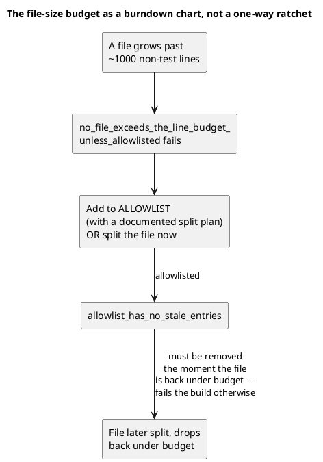
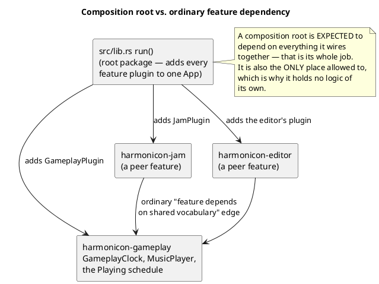

# Module Boundaries and Dependency Rules

Harmonicon's subsystems are **separate crates in a Cargo workspace** (see
[System Overview](overview.md) for the layering), which means the most
important rule here needs no policing at all: a crate may depend only on
ones below it, peers may not depend on each other, and **Cargo cannot
express a cycle** — an import pointing the wrong way is a compile error,
not a review comment.

That covers direction *between* crates. Two things it doesn't cover get
their own automated tests: how big a single file may grow, and cycles
between *modules inside* one crate, which Rust still permits. This
chapter states the rules, where each is mechanically checked, and a
documented exception worth understanding rather than working around.

## Rule 1: unrelated things do not share a file

A file is one concern; its name says what that concern is; landing on a
file via a grep hit should mean everything in it is relevant to what you
were looking for. This is checked mechanically:
`tests/physical_design.rs::no_file_exceeds_the_line_budget_unless_
allowlisted` enforces a ~1000-line budget on non-test code per file (test
modules — `#[cfg(test)] mod tests { ... }` or a sibling `tests.rs` — are
excluded from the count, and files literally named `tests.rs` are
skipped as pure test content with no budget of their own).

The allowlist isn't an escape hatch that quietly accumulates forever —
a second test, `allowlist_has_no_stale_entries`, fails the build if an
allowlisted file has already dropped back under budget, which is what
makes the list function as an honest burndown chart of known,
intentional debt rather than a ratchet that only ever grows. New code
isn't allowed to add itself to the list preemptively — the rule this
enforces is "split before adding to an already-large file," not "budget
permission in advance."

This rule has real teeth: a 2026-07 pass (`docs/physical_design_plan.md`)
measured `gameplay/mod.rs` at 2,921 lines mixing plugin wiring, ~30
resource/component/message types, the score-state model, a 250-line
scoring system, HUD updates, and 1,250 lines of inline tests (43% of the
file) — and split it into the `gameplay/` module structure described in
[The Scoring System](scoring-system.md) and [The Gameplay Clock](
gameplay-clock.md) today. The Song Editor's own `snap.rs` (see
[The Song Editor](song-editor-architecture.md)) was split out of
`state.rs` for exactly this reason, as recently as the same session that
built the feature living in it — this isn't a one-time historical
cleanup, it's an ongoing discipline applied as code is written.

## Rule 2: folders match modules, and dependencies point downward

Code's physical location reflects its level: low-level shared vocabulary
at the bottom, features in the middle, wiring at the top — and nothing
imports *upward*. [System Overview](overview.md)'s layer diagram shows
the shape. The crate split makes this the compiler's problem, but the
judgment call it encodes is still yours to make: **which crate does this
new thing belong in?** Two shapes of wrong answer are worth recognizing,
because both compiled fine when the whole game was one crate.

**Shared vocabulary hiding inside a feature.** An app-wide state machine
is vocabulary every feature needs, not a menu concern — but `AppState`
and friends once lived in `menu`, so gameplay, the editor, the
spectrogram and the profile all reached into `menu` for something that
had nothing to do with menus. Anyone asking "what depends on the menu?"
got a misleading answer. That vocabulary is now `harmonicon-app` (see
[Application States and Modes](app-states.md)), which every feature —
`harmonicon-menu` included — sits above.

**Two peers welded sideways.** Call-and-response once imported the Song
Editor's playback module directly for its synth, when the synth is
shared audio infrastructure with no business living inside an editor
tool. It now lives in `harmonicon-core`, which both depend on
independently. Today `harmonicon-gameplay` and `harmonicon-editor` are
peers and that import wouldn't build — but the diagnosis is what
generalizes: when two features want the same thing, the thing goes
*down*, not sideways.

The same reasoning drove the lessons split. The manifest schema,
prerequisite graph and progress judgment are data and rules, so they
live in `harmonicon-song`; the skill tree and reader are UI, so they
live in `harmonicon-lessons` above the menu crate (see
[The Lessons Engine](lessons-engine.md)). Pushed together into one
crate, the pure layout algorithm would have had an engine in its test
dependency tree for no reason.

## The composition root

Something has to depend on everything, or nothing would ever be wired
together. That job belongs to exactly one place: `src/lib.rs`'s `run()`,
in the root package, which sits above every library crate and adds each
feature's plugin to one `App`.

A composition root being coupled to everything it composes is not the
same failure mode as two peer features being coupled to each other's
internals — so the rule is not "nothing may depend on everything", it's
**"only assembly code may, and assembly code may contain nothing else"**.
`src/lib.rs` is assembly only: plugin registration, the `DefaultPlugins`
configuration, and the handful of startup systems that belong to no
feature. The moment real logic lands there, the exception stops being one.

`harmonicon-jam` and `harmonicon-editor` both depend on
`harmonicon-gameplay` for the shared primitives it exposes —
`GameplayClock`, `MusicPlayer`, the `AppState::Playing` schedule — and
neither can reach the other. When Jam Session needs an ordering
guarantee against a gameplay system, it takes it through a published
`SystemSet`, not a system name.

The practical test for "is this a legitimate composition-root edge, or a
layering inversion sneaking in": is the code doing the depending pure
*wiring* (fine — that's what a composition root does), or is it one
feature's own business logic reaching into another's? The second case
no longer compiles between crates, but it very much still compiles
between *modules* of one crate, which is the shape to watch for now.

## Rule 3: no module cycles inside a crate either

Cargo rules out a cycle *between* crates. It has nothing to say about
one *within* a crate — Rust is perfectly happy for `a.rs` to name `b`
while `b.rs` names `a` — so the workspace split, valuable as it is,
buys nothing here. `tests/physical_design.rs::no_module_dependency_
cycles` closes that gap: it walks every `.rs` file under `src/` **and**
every `crates/*/src/`, builds the graph of `crate::`-qualified
references between top-level modules, and fails on any cycle. Each edge
remembers one witness line, so a failure names the `use` to go delete
rather than just announcing that a cycle exists somewhere.

**This one has no allowlist.** The file-size budget is a burndown chart
because a large file is debt to be paid down on a schedule; a module
cycle is a design error with no "pay it later" story, and every one
found while introducing the check was fixed rather than recorded.

## Two ordering rules that follow from the split

**Cross-crate ordering goes through a `SystemSet`, never a system
name.** `.after(some_private_fn)` forces the owning crate to make the
system *and every one of its parameter types* public, which turns an
implementation detail into permanent API for the sake of one ordering
edge. `dialogs::combobox::ComboboxEscapeSet` and
`gameplay::plugin::MusicVolumeSet` exist for exactly this: publish an
ordering point, keep the implementation private.

**A new crate must forward the `dev`/`trace_tracy` features** to its own
`bevy` dependency (`"harmonicon-x/dev"`). Miss it and Cargo's feature
unification breaks: the build ends up with two differently-configured
Bevy builds, which fails in ways that look nothing like the cause.
