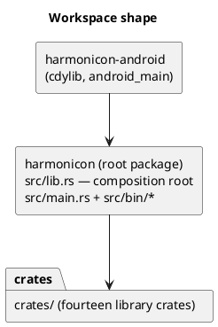
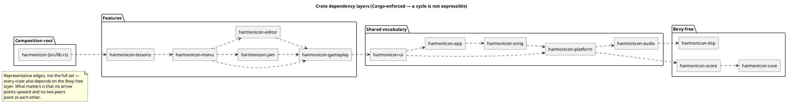

# System Overview

Harmonicon is a rhythm game for diatonic and chromatic harmonica, written
in Rust on top of the [Bevy](https://bevyengine.org/) game engine (version
0.19). The player plays a *real* harmonica into a microphone; the game
listens, detects the pitch being played in real time, and scores it
against a scrolling chart — the same core loop as any note-highway rhythm
game (Guitar Hero, Clone Hero, osu!), except the "controller" is an
acoustic instrument and a live audio pipeline instead of a button press.

## The workspace shape

Harmonicon is a **Cargo workspace** (`edition = "2024"`): fourteen
library crates under `crates/`, a root package holding the binaries and
the composition root, and one crate *above* the root for Android. The
layering is not a convention — it is the dependency graph, and Cargo
refuses to express a cycle, so **an illegal import doesn't compile**.
That is the whole point of the split, and what
[Module Boundaries and Dependency Rules](module-dependency-rules.md)
covers in depth.

`src/lib.rs` is the composition root: its `run()` assembles every plugin
and nothing else. It exists because Android never calls a `main` — it
loads a shared object and calls `android_main` (see
[Android](android.md)) — so both entry points had to become thin
wrappers around one shared function. `src/main.rs` (the game itself) and
everything in `src/bin/` (`hole-editor`, `note-editor`, `note-bench`,
`gen_synthetic_dataset` — small developer tools, described in
[Testing Strategy](testing-strategy.md) and the [Song Editor](
song-editor-architecture.md) chapter) go through it. Assembly only, never
logic.

## The crates

A crate may depend only on ones *earlier* in this list, and **peers may
not depend on each other**.

**Bevy-free layers.** Their whole dependency tree is
`serde`/`serde_json`/`midly`, which is why their tests run in seconds
rather than after an engine link. Keeping `harmonicon-core` free of Bevy
is the single most valuable property of the split; anything needing
`Resource`/`Component`/`App` belongs a level up.

- [`harmonicon-core`](scoring-system.md) — music theory, chart types,
  [scoring math](scoring-system.md), pitch/MIDI conversion, pitch→hole
  resolution, the harmonica synth, WAV, grid snapping, and the generated
  training drills.
- [`harmonicon-score`](chart-and-assets.md) — reading foreign score files
  (MIDI, Guitar Pro 3–7, MuseScore, MusicXML) behind one `ScoreFile`
  trait, and converting a track onto a harmonica.
- [`harmonicon-dsp`](audio-pipeline.md) — the five pitch detectors
  (FFT/YIN/pYIN/MPM/NMF) and their windowing.

**Shared vocabulary**, Bevy-aware but feature-agnostic:

- [`harmonicon-audio`](audio-pipeline.md) — `cpal` capture, the ECS
  wrapper over `harmonicon-dsp`, waveform analysis.
- [`harmonicon-platform`](localization-and-theming.md) — asset discovery
  and the `~/Harmonicon` watcher, [settings](persistence.md),
  localization, theme, responsive layout.
- [`harmonicon-song`](chart-and-assets.md) — chart/manifest loading,
  MIDI-backed songs, and the [lessons](lessons-engine.md) data layer
  (manifests, prerequisite graph, unit gates, progress).
- [`harmonicon-app`](app-states.md) — the `AppState`/`MenuPage` state
  machine, routing flags, [player profile](persistence.md).
- `harmonicon-ui` — `dialogs` (buttons, comboboxes, file dialogs,
  tooltips, scroll areas, the circle-of-fifths and 12-bar-grid teaching
  widgets), the Bravura notation staff, the spectrogram. Intentionally
  has no idea what a "song" or a "lesson" is.

**Features:**

- [`harmonicon-gameplay`](gameplay-clock.md) — the [clock](
  gameplay-clock.md), judging, 2D/3D highways, HUD overlays, adaptive
  difficulty, the Bending Trainer, call-and-response. Also where
  `AppState::Playing`'s schedule is assembled for *every* `GameplayMode`
  — see the composition-root discussion in [Module Boundaries](
  module-dependency-rules.md).
- [`harmonicon-jam`](jam-session-architecture.md) /
  [`harmonicon-editor`](song-editor-architecture.md) — Jam Session and
  the Song Editor. **Siblings**: neither imports the other.
- `harmonicon-menu` — the page state machine, routing, shared menu
  chrome, and the guided tutorial tour.
- [`harmonicon-lessons`](lessons-engine.md) — the lesson tree/reader UI
  and the pure tree layout.
- [`harmonicon-bench`](testing-strategy.md) — the pitch-detection
  benchmark and dataset generator (dev tooling).

**No re-export facades.** A call site names the crate it depends on
(`harmonicon_core::chart`, `harmonicon_gameplay::gameplay::…`), so every
dependency is visible where it's taken. Re-exporting a moved module under
its old path was tried and deliberately removed: it hid which crate code
came from and let modules reach for things casually.

Per-crate architecture notes live in `crates/<name>/CLAUDE.md` — the
load-bearing facts for one subsystem, alongside its code rather than all
in one place.

## The engine and its major dependencies

Beyond Bevy itself, a handful of dependencies carry specific,
non-interchangeable responsibilities worth knowing about up front — each
gets its own discussion in the chapter its responsibility belongs to:

| Crate | Role | Discussed in |
|---|---|---|
| `bevy` 0.19 | ECS, rendering, UI, audio playback, asset system | throughout |
| `cpal` | Cross-platform microphone capture | [Audio Pipeline](audio-pipeline.md) |
| `rustfft` | FFT for pitch detection and the spectrogram | [Audio Pipeline](audio-pipeline.md) |
| `midly` | MIDI file parsing | [Chart Format](chart-and-assets.md), [Jam Session](jam-session-architecture.md) |
| `serde_json` / `jsonschema` | Chart/theme/lesson JSON parsing and schema validation | [Chart Format](chart-and-assets.md) |
| `bevy_fluent` / `fluent_content` | Fluent-based localization | [Localization and Theming](localization-and-theming.md) |
| `figment` | Layered settings-file loading | [Persistence](persistence.md) |
| `notify-debouncer-full` | Filesystem watching for `~/Harmonicon` | [Persistence](persistence.md) |
| `rodio` (decode-only) | OGG/WAV waveform pre-analysis | [Chart Format](chart-and-assets.md) |

## Where to go next

If you're orienting yourself for the first time, read
[The Plugin Architecture](plugin-architecture.md) and
[Application States and Modes](app-states.md) next — together they
describe the skeleton every other chapter's subsystem hangs off of.
