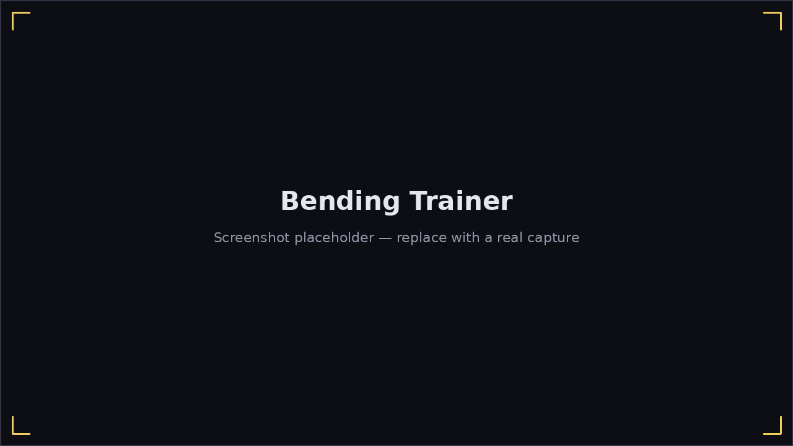

# Bending Trainer

**Play → Bending Trainer** is a standalone ear-training screen — no song,
just the harmonica's full bend diagram, a metronome, and a pitch tuner, for
practicing bends (and overblows/overdraws) in isolation.

The screen splits into two columns:

- **Left — everything but the harmonica**: the key picker, a **Detect**
  algorithm picker (which pitch-detection method to use — the same setting
  Options uses), an ear-training **target** readout with a **Listen**
  button (plays a synthesized reference tone for the current target), a
  live **cents-off tuner readout**, an adaptive **Drill** toggle, and the
  tempo/metronome controls.
- **Right — the harmonica**: the full bend diagram (every hole's blow,
  draw, bend, overblow, and overdraw notes), with its explanatory hint text
  and drill explanation beneath it.

## Picking a target

Click any cell in the bend diagram to make it the current target — its
note name appears in the target readout, and **Listen** plays a clean
synthesized reference tone for it so you know exactly what pitch you're
aiming for before you try to bend to it. The **cents-off tuner** then tells
you, live, how far off (and in which direction) the closest pitch you're
actually playing is.

## Drill mode

Turn on **Drill** and Harmonicon picks targets for you, weighted toward
ones you haven't tried yet or have a lower accuracy on — a spaced-practice
loop instead of you deciding what to work on. Your hit rate per
hole/technique is saved across sessions, so Drill mode gets smarter about
what you personally need to practice the longer you use it.
