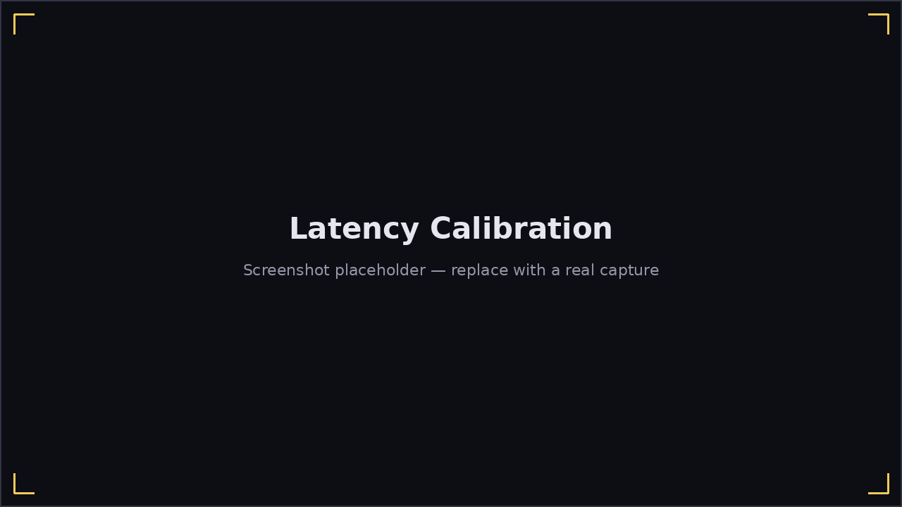

# Calibrating Input Lag

Every microphone and audio setup has a slightly different delay between a
sound happening and Harmonicon actually detecting it — this screen measures
yours and turns it into the **Input lag** offset used to judge timing in
every scored mode.

**Options → Calibrate input lag**:

1. Click to start; a metronome click plays on each of a few beats.
2. Play any note on your harmonica right on each beat — you don't need to
   match a pitch, just the timing.
3. A timing bar shows each hit as it's captured, colored green (perfect)
   or orange (good) by how close it landed.
4. Once enough hits are collected, the screen shows your **mean offset**
   and a **suggested Input lag** value.

The suggested value is also offered as a one-click apply from every song's
results screen afterward, so you don't have to remember to come back here —
if your timing consistently reads a bit early or late during real play,
that's the quicker way to fix it. Running this screen once when you first
set up your mic (and again if you switch microphones or headphones) is
usually enough — it isn't something you need to redo every session.
