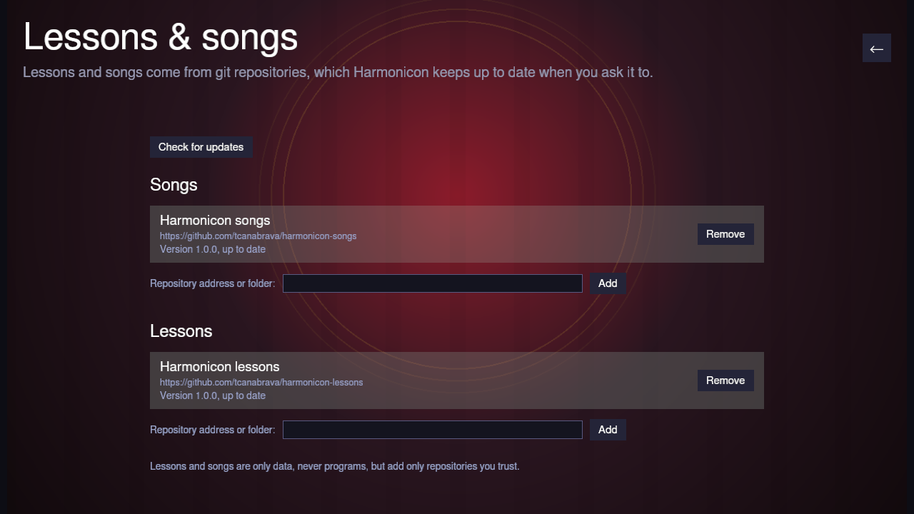

# Lessons & Songs

Harmonicon's lessons and songs don't come inside the game: they live in
online git repositories, so new lessons and songs can arrive without a new
version of the game. **Options → Lessons & songs** shows where yours come
from and keeps them up to date.

The page has a list for songs and a list for lessons. Each repository shows
its name, its address, and how it stands:

- **Version …, up to date** — nothing newer is published.
- **Version …, an update is available** — an **Update** button appears.
  Harmonicon never updates on its own; it asks first, and only downloads the
  newest version, not the whole history.
- **Checking for updates** — Harmonicon asks each repository when the game
  starts, and again whenever you press **Check for updates**. Asking
  downloads nothing.
- **Not downloaded** or **Could not download** — press **Download** to try
  again (an internet connection is needed).
- **Can't be used** — usually because the repository needs a newer
  Harmonicon. Update the game, or remove the repository.
- **A folder on this computer** — see below; it is read as it is, with
  nothing to update.

**Remove** takes a repository off the list and deletes what was downloaded
for it. Your progress is kept: if you add the same lessons back later, the
ones you passed are still passed.

## Adding a repository

Anyone can publish lessons or songs: a git repository laid out like
Harmonicon's own ([harmonicon-lessons](https://github.com/tcanabrava/harmonicon-lessons),
[harmonicon-songs](https://github.com/tcanabrava/harmonicon-songs); each has
a README describing its layout) works on GitHub, GitLab or any other git
host. Type its address — `https://…` or `git@host:owner/name` — into the box
under **Songs** or **Lessons** and press **Add**. Harmonicon downloads it
straight away and its songs or lessons appear alongside the others.

You can also type a **folder on this computer**. Harmonicon reads it in
place and never changes it, which is how lesson and song authors try their
work before publishing it: edit the files, and the game picks the changes up.

Lessons and songs are only data — charts, text and pictures, never programs
— but add only repositories from people you trust.

## The first start

The first time Harmonicon starts, it downloads its lessons and songs before
opening the menu (see [Getting Started](getting-started.md#the-first-launch)).
If you remove every repository, the game still starts; it just has no
lessons or songs until you add some.
