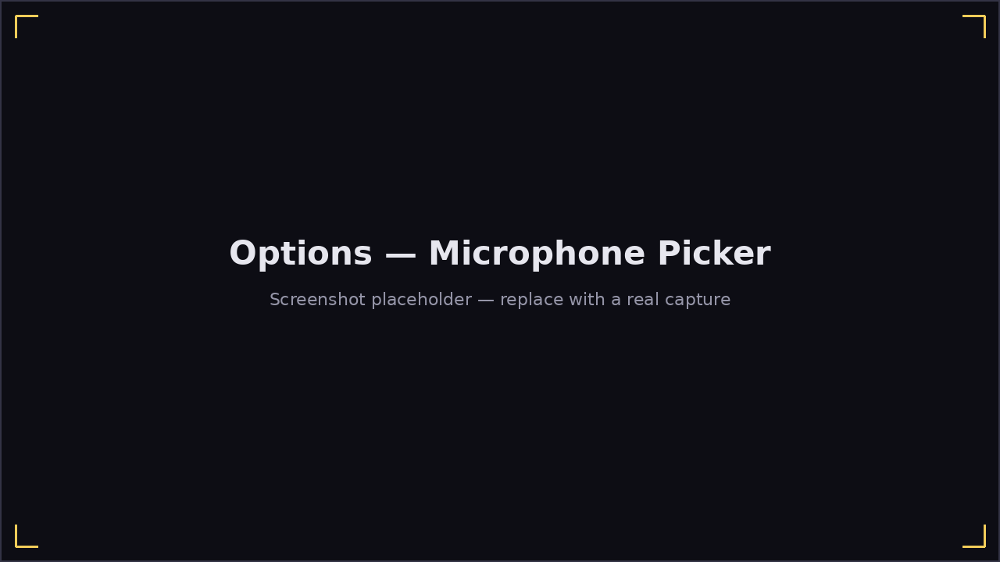

# Getting Started

## Running Harmonicon

Harmonicon is a native desktop application (Windows, macOS, Linux — see the
project's release page or your package manager for a prebuilt binary). If
you're building from source:

```bash
cargo run --release
```

You'll need a **display**, **audio output**, and a **microphone** —
Harmonicon listens to your harmonica through the mic the same way it plays
music through your speakers/headphones.

## What you need to play

- **A harmonica.** Diatonic (10-hole, any key) and chromatic (12- or 16-hole)
  harmonicas are both fully supported. If you don't have one yet, a
  diatonic harp in the key of C is the standard beginner's choice and
  matches most of the bundled [Lessons](lessons.md) content.
- **A microphone.** A laptop's built-in mic works, but a dedicated mic (even
  a cheap USB one) picking up less room noise will make pitch detection
  noticeably more reliable. Position it close to the harmonica, not close
  to your mouth.
- **Headphones are recommended** over speakers — they stop the backing
  track/metronome from bleeding into the mic and being misread as notes
  you played.

## Picking your microphone

Harmonicon uses whatever input device your system reports as default,
but you can pick a specific one from **Options → Microphone**: a dropdown
lists every input device your system exposes. If the game shows a
"no microphone" warning banner, open Options and confirm a working device is
selected — see [Troubleshooting](troubleshooting.md#no-microphone-detected)
if none of them pick up sound.



Before your first scored song, it's worth a quick trip to
**[Calibrating Input Lag](calibration.md)** — every microphone and audio
setup has a slightly different delay between the sound leaving your
harmonica and Harmonicon detecting it, and correcting for it is a
one-time, 30-second step that makes every subsequent judged note more
accurate.

## Adding your own content

Harmonicon also reads from `~/Harmonicon` (a folder in your home
directory) as a second source of songs and themes, alongside what ships
with the game — drop a song folder or a theme folder in there and it shows
up in the song list / theme picker without needing to reinstall anything.
See [Song Editor](song-editor.md) for how to author a chart of your own.

A song folder only strictly needs one thing: a `.harpchart` file (any
filename) inside its `song/` subfolder. Everything else is optional —
`background.png`, `song/*.ogg` for the backing track, and the `2d/`/`3d/`
note art folders — Harmonicon fills in a generated background, plays no
backing track, and falls back to the selected note theme respectively for
whatever's missing, rather than refusing to load the song.
