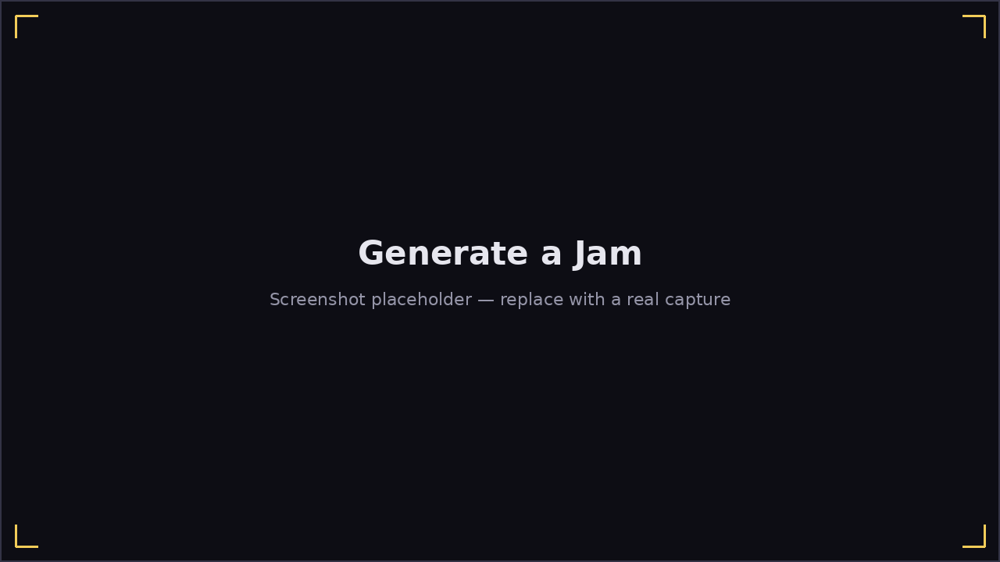

# Generate a Jam

**Play → Generate Jam** skips picking a song entirely: it synthesizes an
endless 12-bar backing on the spot (a swung "blues box" bass line, not a
second harmonica part), so you can jam without needing any existing content.

Before starting, pick:

- **Key** — cycles through all twelve chromatic keys.
- **Tempo** — 60–160 BPM.
- **Progression** — **Standard** (I-I-I-I-IV-IV-I-I-V-IV-I-V, the classic
  12-bar form), **Quick Change** (moves to the IV a bar early), or **Minor
  Blues** (the i/iv chords become minor).

Click **Start Jam** and you're straight into an ordinary
[Jam Session](jam-session.md) — same two-column layout, same live hole-map
feedback, same 12-bar grid — just with a generated backing instead of a
real song's. **Restart** resets the bass to the top of the loop; **Quit
Song** returns to this setup page (with your key/tempo/progression
remembered), not the song list, since there was never a song list involved.
