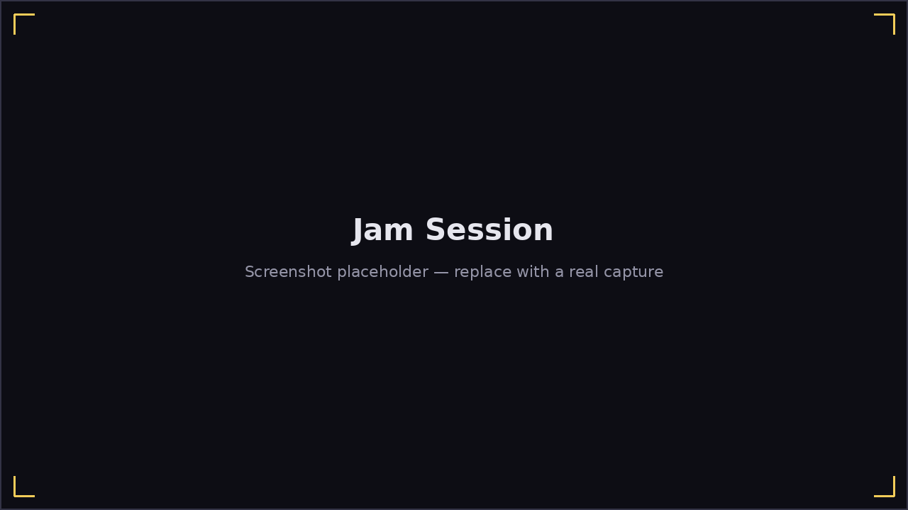

# Jam Session

**Play → Jam Session** is free play: pick an artist and song the same way
as [Playing a Song](playing-a-song.md), but instead of scored falling
notes, you get an open 12-bar backing to improvise over, for as long as you
like — there's no finite end and nothing is scored.

The screen is split into two columns:

- **Left — everything but the harmonica**: the song title, a **Loop**
  toggle (restarts the backing track when it ends, instead of stopping),
  the **12-bar chord grid** (the current bar lights up as the backing
  plays), the **metronome**, and a live **spectrogram** of what your mic is
  hearing.
- **Right — the harmonica**: a reference bend diagram for every hole, plus
  a **live-tinted hole map** — as you play, each hole/direction recolors:
  **gold** for a chord tone of the bar currently sounding, **green** for
  anywhere else in the blues scale, and left dim for out-of-scale notes.
  Follow the color, not memorized theory.

There's no "wrong note" here in the scored sense — the hole map is a guide,
not a judge. It's the same live feedback the
[improvisation lesson](lessons.md#unit-2--counting-the-blues) uses, so
practicing here and in that lesson builds the same skill.

Want a backing track without picking an existing song? See
[Generate a Jam](jam-generate.md).
