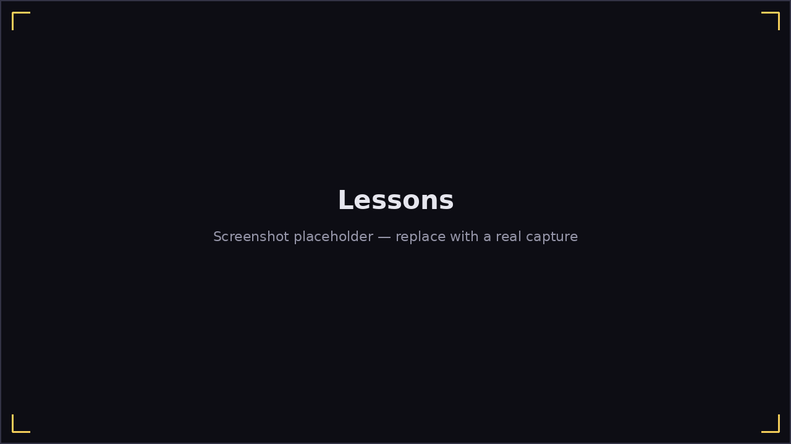

# Lessons

**Main Menu → Lessons** is a guided curriculum, grouped into units shown as
tabs across the top, with a scrollable list of that unit's lessons below.

Lessons **unlock in order**: each one lists its prerequisite(s), and shows
locked (🔒, dimmed, not clickable) until you've passed them. A passed lesson
gets a ✓ and stays replayable any time. Your progress is saved
(`profile.json`) and survives restarting the game.

Clicking an unlocked lesson opens its **reader page**: instructional text
explaining the technique, a goal line (e.g. "Goal: 70% overall accuracy"),
and a **Start Lesson** button (or **Mark as Done**, for the couple of
lessons that are pure instruction with no drill — like tongue blocking,
which the microphone genuinely can't tell apart from puckering, so it isn't
scored).

## Unit 1 — Blowing the Harmonica

Single clean notes, chords, tongue blocking, octave splits, slides, and
hand-shape/wah — the physical fundamentals of getting a controlled sound
out of the instrument, before rhythm or improvisation enter the picture.

## Unit 2 — Counting the Blues

The 12-bar form, playing in time, call-and-response (Harmonicon plays a
short phrase, you echo it back — the game waits for you, however long you
need), and finally **improvisation**: the only lesson with no fixed
notes to hit at all. It opens an ordinary [Jam Session](jam-session.md) and
judges you on how much of what you played landed on a chord tone or in the
blues scale, via the same live hole-map coloring Jam Session itself uses.
When you feel done, open the pause menu and click **Finish Lesson**.

Most drills are scored exactly like a normal [Play 2D](play-2d.md) song
underneath — same falling notes, same HUD — with the pass/fail judgment
layered on top of the ordinary results screen instead of a song's usual
best-score tracking.
