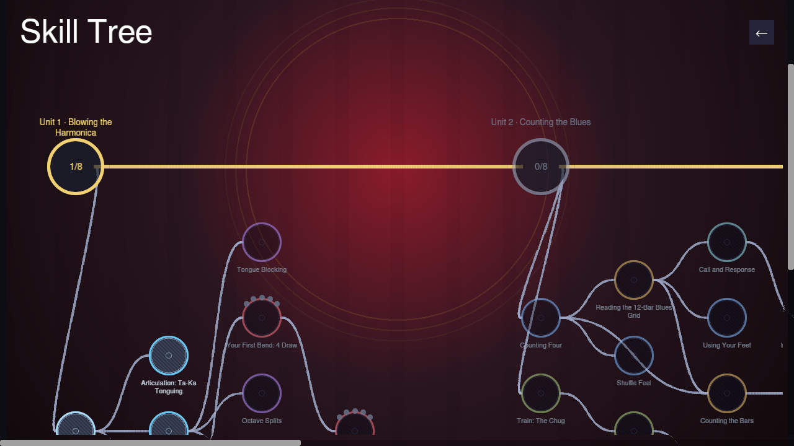

# Lessons

**Play → Lessons** is a guided curriculum, drawn as a skill tree. Along the
top runs a row of **unit** nodes — Unit 1, Unit 2, and so on — and each
unit's lessons hang below it, connected by the order you take them in. The
tree is wider and taller than the window: scroll in both directions to see
the rest of it.

There are **two locks**. A lesson shows dark until you've passed whatever it
leads on from — hover it and the tooltip names what it's still waiting on. A
whole unit stays shut until you've passed most of the one before it; the
number on a unit node ("3/8") is how many of its lessons you've done and how
many open the next unit. It's *most*, not all — one lesson you're stuck on
shouldn't wall off the rest of the course.

Colour is the skill each lesson belongs to (bending, rhythm, tone…), and the
ring of dots over a node is how much of that lesson's **training ladder**
you've cleared — five drills of the same technique at rising speed, offered
on the lesson's own page. A passed lesson stays replayable any time. Your
progress is saved (`profile.json`) and survives restarting the game.

Clicking a lesson — locked or not — opens its **reader page**: instructional
text explaining the technique, a goal line (e.g. "Goal: 70% overall accuracy"),
and a **Start Lesson** button (or **Mark as Done**, for the couple of
lessons that are pure instruction with no drill — like tongue blocking,
which the microphone genuinely can't tell apart from puckering, so it isn't
scored).

## Unit 1 — Blowing the Harmonica

Single clean notes, chords, tongue blocking, octave splits, slides, and
hand-shape/wah — the physical fundamentals of getting a controlled sound
out of the instrument, before rhythm or improvisation enter the picture.
Breathing and long tones, your first bends (working up to the deep 2- and
3-draw bends 2nd-position blues lives on), vibrato, and "ta-ka" tongued
articulation round out the fundamentals.

## Unit 2 — Counting the Blues

The 12-bar form, playing in time, call-and-response (Harmonicon plays a
short phrase, you echo it back — the game waits for you, however long you
need), and finally **improvisation**: the only lesson with no fixed
notes to hit at all. It opens an ordinary [Jam Session](jam-session.md) and
judges you on how much of what you played landed on a chord tone or in the
blues scale, via the same live hole-map coloring Jam Session itself uses.
When you feel done, open the pause menu and click **Finish Lesson**.
Counting drills (four-on-the-floor down to just beat 1, then a full 12-bar
walk of chord roots and the turnaround that leads back to the top), a
straight-vs-shuffle feel drill, and the classic train chug — including a
chorus that genuinely speeds up — round out the unit.

Most drills are scored exactly like a normal [Play 2D](play-2d.md) song
underneath — same falling notes, same HUD — with the pass/fail judgment
layered on top of the ordinary results screen instead of a song's usual
best-score tracking.

## Unit 3 — Blues Vocabulary

The bridge from drills to music. You start with the 2nd-position blues
scale itself, then learn three short original licks call-and-response
style — the game plays each one, you echo it back — followed by a set of
licks built specifically around the "crying" bent notes, and finally a full
12-bar chorus that places a different lick over each chord.

From there it's three more open-jam lessons, each judged on a different
slice of your playing: land specifically on chord tones as the chords
change (not just anywhere in the scale), improvise over a minor blues
progression instead of the usual major one, and — the last lesson — leave
real space, playing two bars and resting two bars through the whole form.
All three use the same "Finish Lesson" pause-menu flow as Unit 2's
improvisation lesson.
