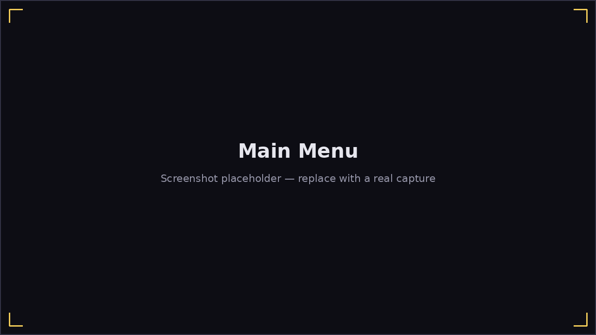

# The Main Menu

The Main Menu is Harmonicon's home screen, with four buttons:

- **Play** — opens the [Play menu](play-menu.md): play a real song, create
  one, jam freely, practice bends, or work through the lessons.
- **Options** — audio, note style, harmonica model, and microphone
  settings. See [Options](options.md).
- **Help / About** — documentation, information about the app, the guided
  tour, and credits. See [Help / About](help-about.md).
- **Quit** — exits the game.

Press **Esc** on any menu page to go back one level; there's no dedicated
Back button needed on the Main Menu itself, since it's the top of the
hierarchy.
