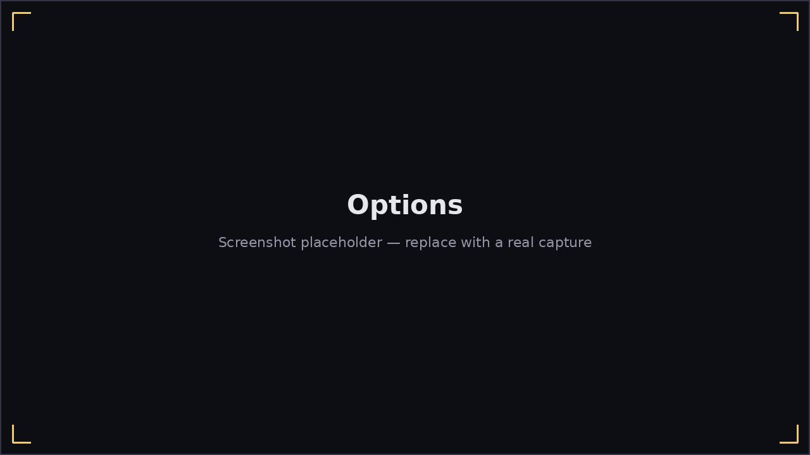

# Options

**Main Menu → Options** holds every audio and display setting:

- **Music** / **Metronome volume** sliders.
- **Input lag** slider — manually nudges the same offset
  [Calibrating Input Lag](calibration.md) sets automatically; the results
  screen after a scored song also offers a one-click "apply the measured
  offset" shortcut if your timing consistently reads early or late.
- **Microphone** — a dropdown of every input device your system reports.
  A warning banner appears here (and nowhere else) if no working
  microphone is detected; see
  [Troubleshooting](troubleshooting.md#no-microphone-detected).
- **Harmonica model** — pick which 3D harmonica model [Play 3D](
  play-3d.md) and the [Bending Trainer](bending-trainer.md) render, with a
  live rotating preview of each option.
- **Pitch detect** — which pitch-detection algorithm to use (FFT, YIN,
  pYIN, MPM, or NMF), each with a short explanation of its trade-offs
  shown alongside the picker. The default works well for most setups;
  switch algorithms here if pitch detection feels unreliable for your
  particular mic/harmonica combination.
- **Note labels** — swaps the up/down arrow on falling notes for the
  actual hole number, in both [Play 2D](play-2d.md) and [Play 3D](
  play-3d.md).
- **Theme** — opens the [theme picker](themes.md).
- **Calibrate input lag** — opens [input-lag calibration](calibration.md).

All Options settings persist to disk automatically and apply the moment
you change them — there's no separate "Apply" or "Save" step.
