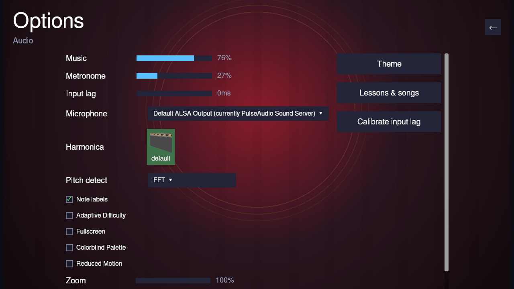

# Options

**Main Menu → Options** holds every audio and display setting:

- **Music** / **Metronome volume** sliders.
- **Input lag** slider — manually nudges the same offset
  [Calibrating Input Lag](calibration.md) sets automatically; the results
  screen after a scored song also offers a one-click "apply the measured
  offset" shortcut if your timing consistently reads early or late.
- **Microphone** — a dropdown of every input device your system reports.
  A warning banner appears here (and nowhere else) if no working
  microphone is detected; see
  [Troubleshooting](troubleshooting.md#no-microphone-detected).
- **Harmonica model** — pick which 3D harmonica model the Credits page
  shows, with a live rotating preview of each option.
- **Pitch detect** — which pitch-detection algorithm to use (FFT, YIN,
  pYIN, MPM, or NMF), each with a short explanation of its trade-offs
  shown alongside the picker. The default works well for most setups;
  switch algorithms here if pitch detection feels unreliable for your
  particular mic/harmonica combination.
- **Note labels** — swaps the up/down arrow on falling notes for the
  actual hole number, in both [Play 2D](play-2d.md) and [Play 3D](
  play-3d.md).
- **Adaptive Difficulty** — off by default; turns on gradual note
  unlocking for every song (see [Playing a Song](playing-a-song.md)). One
  setting shared by every song, not picked per song — the pause menu's own
  toggle during a song changes this same setting.
- **Fullscreen** — borderless fullscreen on the current display.
- **Colorblind Palette** — a fixed colorblind-safe blow/draw colour pair
  on the highway instead of the current theme's note colours.
- **Reduced Motion** — stills the decorative motion on the highway: the
  pop when a note is hit, the flowing animation on note tails and the
  shimmer on a held note. Notes
  keep scrolling as usual (that *is* the game), a missed note still
  shrinks — just immediately, without the movement into it — and the hit
  line never moves either way. On the skill tree, opening or closing a
  unit snaps straight to the new layout instead of animating.
- **Zoom** — scales the whole interface.
- **Theme** — opens the [theme picker](themes.md).
- **Lessons & songs** — where your lessons and songs come from, and
  their updates: see [Lessons & Songs](content-sources.md).
- **Calibrate input lag** — opens [input-lag calibration](calibration.md).

All Options settings persist to disk automatically and apply the moment
you change them — there's no separate "Apply" or "Save" step.
