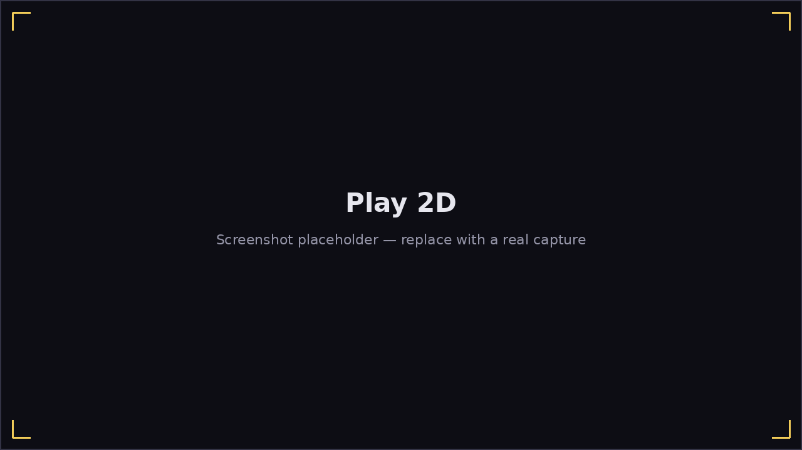

# Play 2D

The 2D mode shows notes as a **falling note highway**: ten lanes (one per
harmonica hole), each note a colored "comet" with a tail sized to its
duration, scrolling down toward a fixed hit line.

- Notes are colored by **breath direction** — blow and draw each get their
  own color, shown in the legend beside the highway.
- A note recolors gold the instant it's hit, and red if it's missed.
- The **hole strip** along the bottom mirrors your harmonica, live —
  useful for double-checking which hole/direction a note actually wants
  without reading the lane position.
- Optional **hole-number labels** (Options → Note labels) replace the
  plain up/down arrow on each note with its actual hole number, if you'd
  rather read "4" than work out the arrow from the lane.
- The **12-bar chord grid**, **metronome**, **technique legend**, and
  **score/combo** all sit in the HUD to the side of the highway.
- A **tab-notation ribbon** shows the current musical phrase's notes as
  plain text (e.g. `-4' +5 -4`) as they come up — handy if you're more
  comfortable reading harmonica tab than the highway.

Everything else — scoring, pausing, looping, adaptive difficulty — works
identically to [Play 3D](play-3d.md); see [Playing a Song](
playing-a-song.md) for the shared details.
