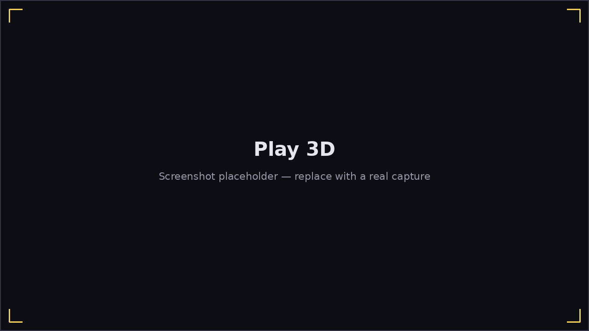

# Play 3D

The 3D mode shows the same chart, notes, and scoring as [Play 2D](
play-2d.md), but renders a **3D harmonica model** in front of the camera
with notes flying toward it — a more immersive, "you are holding this
harmonica" view of the same gameplay.

- The harmonica model matches your selected **note theme/harmonica model**
  (Options), and reacts live to what you actually play.
- Optional hole-number labels (Options → Note labels) show as small dark
  pills near each incoming note, the 3D equivalent of 2D's on-note labels.
- Chromatic harmonicas don't yet have a dedicated 3D model — a diatonic
  model is shown in its place if you're playing a chromatic chart in 3D.

Scoring, the HUD, pausing, A–B looping, Wait for Note, Practice Speed, and
Adaptive Difficulty all work exactly as described in
[Playing a Song](playing-a-song.md) — 2D and 3D are purely a visual choice
made once, at Select Mode.
