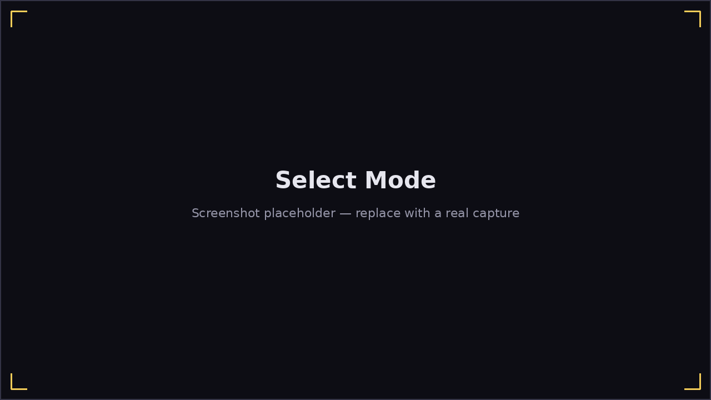
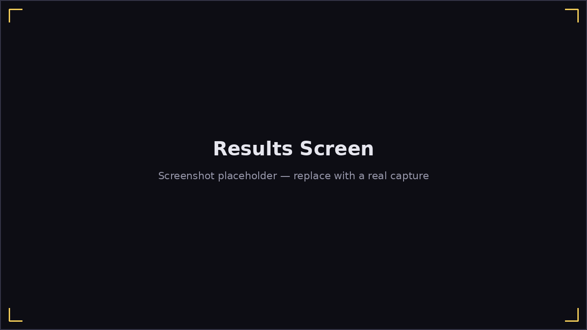

# Playing a Song

**Play → Play Song** starts the scored song flow:

1. **Select Mode** — choose [Play 2D](play-2d.md) (a scrolling note
   highway) or [Play 3D](play-3d.md) (a 3D harmonica model you play along
   with). Both modes share the same scoring, timing, and pause menu — it's
   purely a visual choice.
2. **Select Artist**, then **Select Song** — browse the bundled songs (and
   anything you've dropped into `~/Harmonicon/songs/`, see
   [Getting Started](getting-started.md#adding-your-own-content)).
3. A **3-2-1 countdown** plays, showing the song title, key, and which
   physical harmonica to grab, then the chart starts scrolling and the
   backing track plays.

## Scoring

As notes reach the hit line, Harmonicon compares the pitch it hears against
what the chart expects, at that instant:

- **Perfect** / **Good** hits, based on how close your timing was to the
  note's onset.
- **Miss**, if the window passes with nothing (or the wrong pitch) played.
- Longer notes reward **holding** the correct pitch for their full
  duration, not just landing the onset.
- Special techniques — **bends**, **vibrato**, **wah**, **overblow/
  overdraw**, and (chromatic only) **slides** — are validated on their own
  terms, not just "was some pitch playing": a bend note checks you actually
  bent to the target pitch, a vibrato/wah note checks the oscillation rate
  you played matches what the chart asks for.
- **Chords and octave-split notes** only score when every note in the
  group sounds *together* — playing the same holes correctly but one at a
  time doesn't count.

A combo multiplier builds on consecutive hits and resets on a miss. The
**Results screen** after each song breaks your accuracy down **by
technique** (not just an overall percentage), so you can see at a glance
whether it was your bends or your timing that need work.

## Pausing and quitting

Press **Esc**, or click the **⏸** button in the bottom-right corner, to
pause mid-song — the on-screen button works the same as Esc, no keyboard
required. The pause menu is two columns: **Resume** / **Restart** / **Quit
Song** on the left, every practice aid on the right, so a slip of the mouse
over one can't misclick the other. The practice aids:

- **Wait for Note** — freezes the highway and music the instant an unhit
  note reaches the hit line, and holds there until you play it — useful
  for slowing down a hard passage without losing your place. There's no
  way to "miss" a frozen note; it just waits.
- **Practice Speed** — a slider from 50% to 100% that slows the highway and
  metronome without pitch-shifting the audio; it mutes instead below 100%,
  so you never hear a chipmunked backing track.
- **Adaptive Difficulty** — on by default: a song's notes unlock gradually
  as you clear each phrase cleanly, instead of throwing the full chart at
  you immediately. To override a specific phrase, click its rectangle on
  the song-progress bar's bottom strip (it highlights gold once selected)
  and drag the **Learned** slider that appears below — or turn the whole
  feature off with the toggle.
- **A–B Looping** — drag on the song-progress bar at the top of the screen
  to mark a section and loop it, for drilling one phrase repeatedly.
  **Clear Loop** removes it.

See the [Controls Reference](controls.md) for every in-game keybinding.
