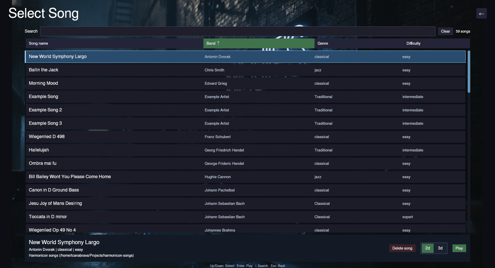
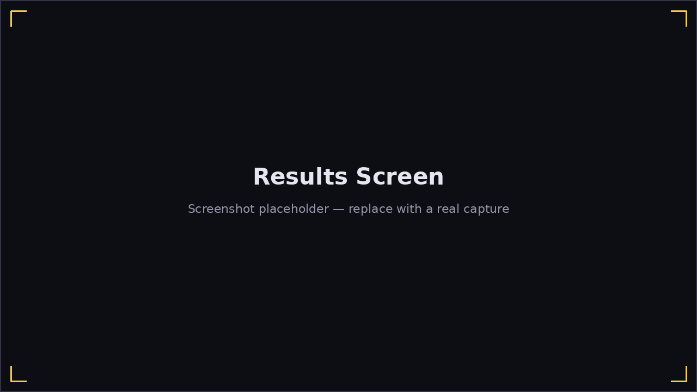

# Playing a Song

**Play → Play Song** starts the scored song flow:

1. **Select Song** — browse all downloaded songs and anything you've added to
   `~/Harmonicon/songs/` (see
   [Getting Started](getting-started.md#adding-your-own-content)). Click a column
   header to sort by song name, band, genre, or difficulty; click it again to
   reverse the order. Search accepts partial words and small typos.
2. Choose **2d** or **3d** with the switch beside **Play**. [Play 2D](play-2d.md)
   uses a scrolling note highway; [Play 3D](play-3d.md) puts the same notes on
   a lane in perspective. Both share scoring, timing, and the pause menu.
3. Use Up/Down to select a song and inspect its details, then press Enter or
   **Play**. Clicking a song starts it directly. `/` focuses Search; **Clear**
   resets the filter. Hovering a song previews its details without taking focus
   away from Search.
4. Confirm the physical harmonica you are holding. A **3-2-1 countdown** then
   shows the song title and key before the chart and backing track start.

When a repository check finds newer songs, an **Update songs** button appears
above the catalog. Confirm it to download that repository’s latest version;
the catalog refreshes when the download finishes. If a download fails, the
existing songs remain available and you can retry the update. Checks are available in
**Options → Lessons & songs**.

## Removed and hidden songs

Updates keep your local copy of songs removed from a repository, including
backing tracks. Select one to see **Kept locally — no longer in …** and its
source repository. If it returns to that repository, the latest copy replaces
the retained version and the warning disappears. Each repository keeps its
own copies independently.

**Delete song** hides the selected song from that source after confirmation;
it keeps the files. Hidden songs stay hidden across updates and restarts,
even if their chart filename changes. A copy from another repository remains
visible. Exclusions are stored in `hidden-songs.json` beside `settings.json`.
To restore a hidden song, remove its entry from that file while the game is
closed.

## Pickups and repeats

Some tunes start before the first full bar — the "and a" before bar 1.
The game counts those opening notes as the end of an extra bar, the way a
musician would: the metronome accents bar 1's downbeat rather than the
first note, and the beat guides and notation staff line up with it.

A song written with repeat signs plays them out in full. A repeated
passage comes round again, first- and second-time endings are taken on
the right pass, and every note of every pass is scored.

## Lyrics

A song with words shows them karaoke-style under the notation staff: the
current line lights up syllable by syllable as each one's note is played,
and the next line waits dimmed below it so you can read ahead. Songs
without lyrics show nothing there.

## Scoring

As notes reach the hit line, Harmonicon compares the pitch it hears against
what the chart expects, at that instant:

- **Perfect** / **Good** hits, based on how close your timing was to the
  note's onset.
- **Miss**, if the window passes with nothing (or the wrong pitch) played.
- Longer notes reward **holding** the correct pitch for their full
  duration, not just landing the onset.
- Special techniques — **bends**, **vibrato**, **wah**, **overblow/
  overdraw**, and (chromatic only) **slides** — are validated on their own
  terms, not just "was some pitch playing": a bend note checks you actually
  bent to the target pitch, a vibrato/wah note checks the oscillation rate
  you played matches what the chart asks for.
- **Every note is a ribbon** as long as the note lasts, in both Play 2D
  and Play 3D. Its bright front edge is the attack — play when it reaches
  the hit line — and the technique is drawn along it: a **vibrato** is a
  wavy line and a **wah** pinches the ribbon in and out, both spaced so
  each swing crosses the hit line at the rate the chart asks for (follow
  the ribbon and you're wobbling at the right speed); a **bend** steps the
  ribbon's bright core sideways, further for a deeper bend.
- **Each technique note says what it wants.** The note's tab carries the
  bend depth — one `'` per half step, so `-3''` is draw 3 bent a whole
  step — and a short label beside the note gives the note to land on
  (*→ A*) or the wobble rate to play (*vib 5/s*: five swings a second).
- **A coach bar at the end of the track** guides the technique as you
  play it. It sits between the highway and the hole strip, never moves,
  and uses large type. For a bend it runs from the unbent note on the left
  to the target on the right, with the target band in green; the marker is
  your pitch, so bending slides it right, and it turns green once you're
  there (*Bend more* / *Hold it* / *Too far*). For vibrato or wah, a pale
  tick swings at the rate the chart asks for — copy it — and once you're
  holding the note your own pitch (vibrato) or volume (wah) swings beside
  it, with *Faster*, *Slower*, *Wider* or *Good* at the end, judged exactly
  as the score is. Songs without bends, vibrato or wah don't show the bar.
- **Chords and octave-split notes** only score when every note in the
  group sounds *together* — playing the same holes correctly but one at a
  time doesn't count.

Every judgment shows on the note itself, not just in the readout by the hit
line: a hit note's ribbon **widens** for a moment and turns gold, its tab
becoming a **✓**; a missed one **narrows**, dims to red and gets a **✗** —
so hit and miss are told apart by shape as well as colour. While you hold
a long note, the part of its ribbon still above the line stays **gold as
long as the right pitch is sounding** and goes grey the moment it drops
out; on a vibrato or wah note
the gold **shimmers** once the wobble is heard at the right rate, before
the hold ends, so you can correct it in time.

A combo multiplier builds on consecutive hits and resets on a miss. The
**Results screen** after each song is written as coaching, not just a
scoreboard:

- **Accuracy leads, with one observation under it** — the single most
  useful thing the run showed: a technique that trailed your plain notes,
  too many notes that never sounded, hits that consistently came in late
  or early, or attacks with a neighbouring hole leaking. It only says
  something it has evidence for — one attempted bend is never "your bends
  need work" — and says "nothing stands out" when a run is solid.
- **Timing as a distribution**, not an average: an early / on-time / late
  bar with the counts. The one-click **Input lag** adjustment (see
  [Calibrating Input Lag](calibration.md)) appears only when your hits
  actually lean one way, since a wide scatter can average to a number
  without any lag being the cause.
- **By technique**, ranked by where practice would pay off most, always
  with the sample counts alongside.
- **Practice missed section** loops the two bars where you missed the
  most, using the same A–B loop the pause menu offers, and starts you
  there rather than from the top of the song. Leave it with **Esc** →
  **Quit Song**, or clear the loop from the pause menu to carry on
  through the rest.

For a lesson, the pass/fail verdict and how far you got toward its goal
sit above all of that.

## Pausing and quitting

Press **Esc**, or click the **⏸** button in the bottom-right corner, to
pause mid-song — the on-screen button works the same as Esc, no keyboard
required. The pause menu is two columns: **Resume** / **Restart** / **Quit
Song** on the left, every practice aid on the right, so a slip of the mouse
over one can't misclick the other. The practice aids:

- **Wait for Note** — freezes the highway and music the instant an unhit
  note reaches the hit line, and holds there until you play it — useful
  for slowing down a hard passage without losing your place. There's no
  way to "miss" a frozen note; it just waits.
- **Practice Speed** — a slider from 50% to 100% that slows the highway and
  metronome without pitch-shifting the audio; it mutes instead below 100%,
  so you never hear a chipmunked backing track.
- **Adaptive Difficulty** — off by default (turn it on in **Options**,
  under Audio); once on, a song's notes unlock gradually as you clear each
  phrase cleanly, instead of throwing the full chart at you immediately.
  This is one setting shared by every song, not something you pick per
  song. To override a specific phrase, click its rectangle on the
  song-progress bar's bottom strip (it highlights gold once selected) and
  drag the **Learned** slider that appears below — or flip the pause
  menu's own toggle to switch it off/on immediately, mid-song (this also
  updates the Options-menu setting).
- **A–B Looping** — drag on the song-progress bar at the top of the screen
  to mark a section and loop it, for drilling one phrase repeatedly.
  **Clear Loop** removes it.

See the [Controls Reference](controls.md) for every in-game keybinding.
