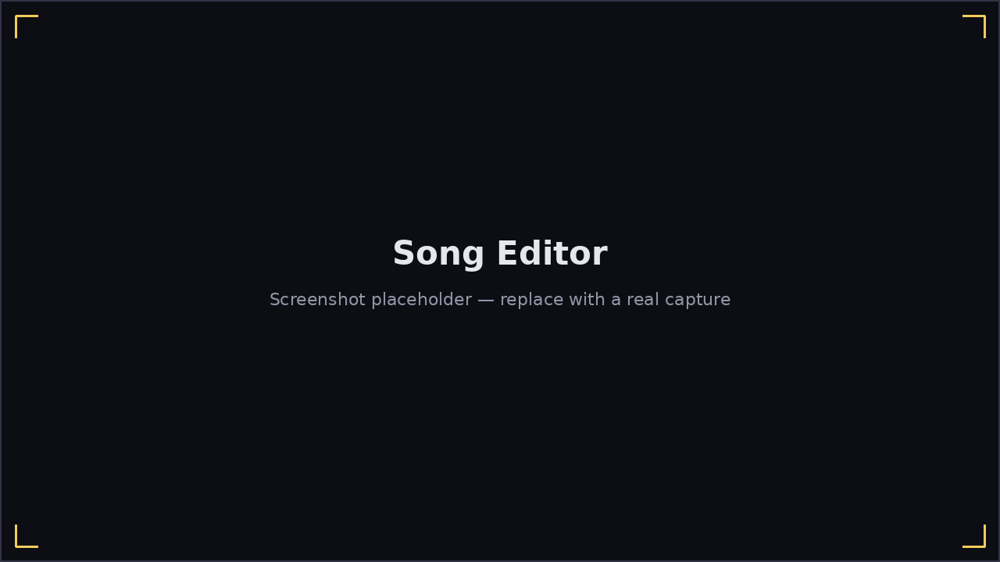

# Song Editor

**Play → Create Song** is Harmonicon's chart authoring tool — a piano-
roll-style grid for building or editing a `.harpchart` file by hand,
without writing JSON directly.

## Modes

- **Edit mode** — place, move, resize, and delete notes on the grid.
  Click an empty cell to add a note; drag a note's edges to resize it or
  its body to move it. The **mod panel** on the side sets the selected
  note's technique: Blow/Draw direction, bend depth, overblow/overdraw,
  slide (chromatic only), wah/vibrato rate, or delete it outright.
- **Record mode** — play your harmonica and have it write notes onto the
  grid for you, with its own Play/Pause/Stop/Finish transport (see
  [Recording notes live](#recording-notes-live) below).
- **Play mode** — plays the chart back (▶ Play / ⏸ Pause / ■ Stop), or
  switches to **Practice**: play along on your actual harmonica and get
  the same live pitch feedback a real song gives, against the chart
  you're currently editing — the fastest way to sanity-check a chart
  actually feels right before saving it.
- **Lock** — freezes the grid against accidental edits while you're just
  reviewing or practicing.

When a song runs wider than the window, a horizontal scrollbar appears
under the grid — and it doubles as a **minimap**: every note shows as a
tiny blow/draw-colored rectangle at its place in the full song, so you can
see at a glance where the phrases are and drag straight to them.

## Chart metadata

The meta-form covers a chart's song-level fields: music tempo, harp key,
playing position, harmonica type (diatonic/chromatic, and hole layout),
background music file, and song name/author — everything under `song` and
`harmonica` in the `.harpchart` format.

### Scale and note colors

Every note on the grid is tinted by the technique it's played with — plain
blow/draw, bend, overblow, overdraw, or slide — and gets a warm red tint
blended in if it falls outside a reference scale, as a gentle "you're
reaching outside this scale" flag rather than an error. The third column
next to the meta-form fields is a full legend for every color the editor
uses, in case any of this is unclear at a glance.

The **Scale** field, just above the mod panel, picks that reference scale:

- **1st/2nd/3rd Position** — the blues scale, rooted at the harp's own key,
  a fifth above it, or a whole step above it respectively (matching the
  three classic cross-harp playing positions).
- **Major Scale** / **Minor Pentatonic** / **Country Scale** — rooted
  directly on the harp's key, for melodies that aren't blues-flavored at
  all.

It defaults to 1st Position, and only affects this warning color — it
never changes which notes you can actually place.

## Authoring a lesson

The **Recording** field in the meta form cycles between **Record Song**
and **Record Lesson**. Switching to Record Lesson doesn't change anything
about editing notes, playing back, or practicing — it just adds a
curriculum layer on top of the chart you're building, so a lesson's chart
is really just an ordinary chart with some extra metadata attached.

Click the **▸ Lesson Details** header to expand the curriculum fields
(collapsed by default, so it stays out of the way while you're just
placing notes):

- **Lesson ID** and **Unit** — the lesson's identity and which curriculum
  unit it's grouped under in the [Lessons](lessons.md) list.
- **Explanation** — the instructional text shown on the lesson's reader
  page.
- **Prerequisites** — a comma-separated list of lesson IDs that must be
  passed first, before this one unlocks.
- **Pass Criteria** — how the lesson is judged: an accuracy threshold, a
  specific technique's accuracy, or (for an open-jam lesson with no fixed
  notes) scale adherence, chord-tone adherence, or phrase discipline.
  **Threshold** and **Technique** only appear when the chosen criterion
  actually needs them.
- **Progression** — the backing chord progression an open-jam lesson
  starts with (standard, quick-change, minor, or none).

Saving writes a `lesson.json` file (validated against the lesson schema
before writing) alongside the chart, if the grid has any notes on it.
**One thing `lesson.json` can't do**: it stores the lesson's title and
explanation as Fluent *keys*, never the actual display text you typed —
Harmonicon's translated-text system needs real entries in each supported
language's locale file, which this tool can't generate for you. After
saving, check the game's log/console: it prints the exact key/text pairs
to add by hand.

A lesson save doesn't carry over a MIDI-imported backing track — author
the chart as an ordinary song first if it needs one, then switch to
Record Lesson to add the curriculum fields on top.

## Erasing and removing parts of a song

The **Select** tool in the mod panel (next to Delete) turns the ruler above
the grid into a range selector for a whole span of time rather than one
note at a time — handy for a song built from an imported MIDI track that
starts later than beat 1, or just cutting a section you don't want.

With Select active: click-drag-release across the ruler to pick a range —
and if the range you want runs past the edge of the screen, just wheel-
scroll while still holding the drag; the grid pans, newly revealed notes
appear, and the selection keeps growing to follow. Alternatively, click a
point on the ruler to drop a split marker, then click either side of it to
select everything from there to that edge of the song.

The selection itself changes nothing. With a range selected, the **Erase**
and **Remove** buttons act on it — a confirmation dialog names the exact
range before anything happens. **Erase** deletes the notes in that range
and leaves a gap; **Remove** deletes them *and* shifts every note after the
range earlier to close the gap, shortening the song. Escape clears a
selection or pending split marker.

## Silence track

A thin strip below the last hole lane, labeled "Silence", shows the gap
between consecutive notes as a block giving its length in seconds —
useful for spotting an unintentionally long rest, or confirming a deliberate
one lines up with the phrasing you meant. A chord, or notes placed back to
back with no rest between them, shows no block; there's also none before the
first note or after the last, since there's no gap to measure there. It's
purely a display — nothing on it is clickable.

## Importing MIDI

**Import MIDI** loads a `.mid`/`.midi` file and lists its tracks in a
dropdown; picking one drops that track's notes onto the grid, mapped onto
your currently selected harp key and type — an exact note where one exists,
a bend or (on a chromatic harp) a slide where one doesn't, otherwise the
nearest playable note — and sets the chart's tempo to match. Switching the
dropdown to a different track re-imports from that track instead.

Saving while a MIDI track is selected also writes two extra files next to
the chart: a copy of the MIDI file with the imported track removed (your
original file is never touched), and a synthesized backing track —
`song/music.wav` — built from every *other* track in the file, since
Harmonicon can't play a raw MIDI file directly. That backing track plays
automatically both in the editor's own Play preview and, once the song is
in place, during the real game.

## Recording notes live

**Record mode** writes a chart by ear, with a transport of its own:

- **▶ Play** starts a take from the current playhead position — the
  beginning on a fresh take, wherever you clicked on the ruler, wherever
  the last take stopped, or (resuming) wherever you paused. The chart's
  background music plays from that same position.
- **⏸ Pause** freezes the take in place — whatever note you're holding is
  closed right there — and Play (or Pause again) resumes exactly where you
  left off, as the same take.
- **⏹ Stop** ends the take and leaves the playhead where it stopped, so
  the next take can pick up from there.
- **⏹ Finish** ends the take and rewinds to the beginning — you're done,
  or ready to re-record the passage from the top.

While no take is running, **clicking the ruler above the grid moves the
red playhead line** to that spot; Play then records from there — the
quickest way to punch in on a specific passage.

Each note appears on the grid the instant you start playing it and keeps
growing for as long as you hold it, so you watch it take shape in real
time rather than only seeing it once you stop. Notes are mapped onto your
currently selected harp key and type exactly the way MIDI import maps a
file's notes (an exact note where one exists, a bend or slide where one
doesn't) — a bend you actually play and hold is recorded as a bend, not
snapped to the nearest natural note. The status bar shows a running count
of notes captured while you play.

Recording **punches in**: a note you play replaces whatever the grid
already had at that moment — notes from an earlier take, imported or
hand-placed ones — instead of stacking impossible blow-and-draw-at-once
combinations on top of them. Notes played earlier in the *same* take
(including the other notes of a chord) are never touched, and neither is
anything at times you stay silent over.

While recording, pitch detection is tuned to your selected harp: only
sounds that harp can actually make are considered (a stray harmonic or
room noise at an impossible pitch is ignored rather than snapped onto the
grid), a note that flickers for only a single instant is treated as noise
and removed again, and a brief detection dropout mid-note won't split a
held note in two. Detected notes are also placed slightly earlier than the
moment they're recognized, compensating for the analysis delay — plus
whatever input latency you've calibrated on the Options page — so takes
land on the beat you actually played. Two tips for cleaner takes: wear
headphones if the chart has background music (otherwise the microphone
hears the music too and can record its notes as yours), and the **MPM**
pitch algorithm on the Options page is a strong choice for single-note
playing.

Outside the span you actually play over, recording never deletes or
replaces what's already on the grid, so successive takes build up a chart
incrementally. If the chart has background music set, it plays
automatically while you record, the same as Play and Practice, so you can
play along to it.

## Saving and loading

**Save**/**Load** work with `.harpchart` files directly; **Browse** picks
the background-music audio file a chart references. A saved chart is
validated against Harmonicon's chart schema (`assets/song_schema.dtd.json`)
and tagged with the format version it was written against, so a chart
saved by a newer Harmonicon that added something this version's Song
Editor doesn't understand will point that out clearly instead of silently
mis-loading.

For songs you want the game to discover automatically without editing the
bundled assets, drop the finished chart folder into `~/Harmonicon/songs/`
(see [Getting Started](getting-started.md#adding-your-own-content)).
