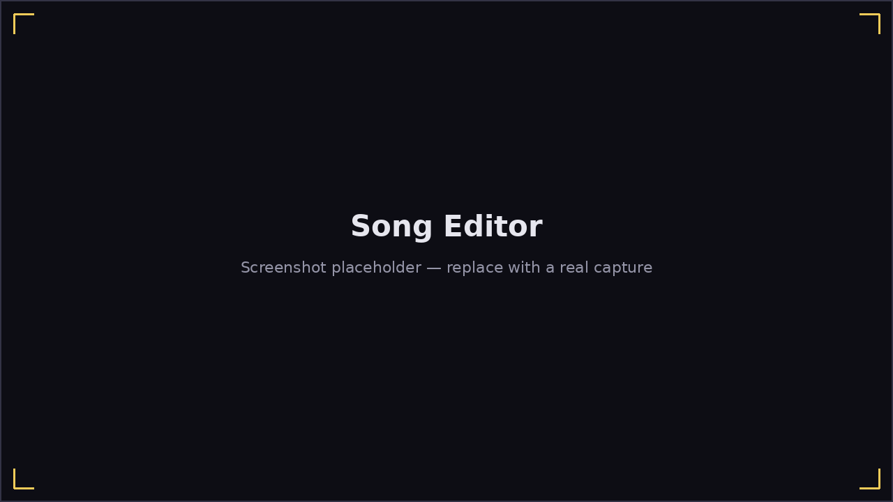

# Song Editor

**Play → Create Song** is Harmonicon's chart authoring tool — a piano-
roll-style grid for building or editing a `.harpchart` file by hand,
without writing JSON directly.

## Layout

The screen has three parts:

- The **tool sidebar** down the left edge, in two columns. The **left
  column** is about the song and the tools: Back, the mode buttons, lock,
  undo/redo, copy/paste, the Select/Erase/Remove/Tempo/Meter tools, the
  [Repeat and Ending](#repeats-and-endings) buttons, metronome,
  legend, and Save/Load. The **right column** is about *the note* — the
  selected one, or the next one you'll place: Blow/Draw, bend/overblow/
  overdraw (or slide), wah/vibrato and their depth, the phrase's Call and
  Split marks, the phrase editor, and Delete. With nothing selected the
  right column previews what a newly placed note gets, so it's never
  empty. It only appears in Edit mode; Record and Play fold the sidebar
  back to one column and give the grid the width. Either column scrolls —
  **drag it** or use the **mouse wheel** over it — because on a short
  screen the whole palette doesn't fit at once.
- The **note grid**, one lane per harmonica hole, under the **Chart**
  tab, with a **notation staff** below it showing the same notes as sheet
  music. The staff follows the grid as you scroll (and the playhead while
  playing), and the notes you select are drawn in gold on it too, so you
  can see where the selection sits in the music.
- The song's metadata (tempo, key, position, title, background music,
  and the lesson fields) under the **Details** tab.

Chart and Details are tabs rather than stacked panels so the grid gets the
full height of the window — on a laptop screen, and especially on a phone,
the grid alone can fill it.

The sidebar's buttons can show **icons only, text only, or both** — set it
under Options → *Button style*. Icons-only makes the sidebar much narrower
and is what puts the two columns side by side; with text labels they stack
into one column instead. Every button keeps a tooltip either way, so
hovering always tells you what it does.

## Modes

- **Edit mode** — place, move, resize, and delete notes on the grid.
  Click an empty cell to add a note; drag a note's edges to resize it or
  its body to move it. The sidebar's **note column** sets the selected
  note's technique: Blow/Draw direction, bend depth, overblow/overdraw,
  slide (chromatic only), wah/vibrato rate and **Depth** (¼ ½ ¾ 1,
  stepped by clicking, like the rate), or delete it outright.
  **Ctrl+click** adds or removes a note from the selection instead of
  replacing it, so you can select several at once; dragging any one of
  them moves the whole group together, keeping their relative positions.
  The technique buttons act on the whole selection too: the last note you
  clicked decides the value (the next bend depth, vibrato rate or depth
  step), and every selected note that can play it takes it. Notes that
  can't, such as an overblow on hole 2, keep what they had, and the status
  bar says how many.
  Use **Transpose up** (♯) or **Transpose down** (♭) to move the selection by
  one semitone; with no selection, they transpose the whole chart. Harmonicon
  recomputes the hole, breath, and technique on the current harp and leaves a
  note unchanged when the destination is unplayable or occupied.
- **Record mode** — play your harmonica and have it write notes onto the
  grid for you, with its own Play/Pause/Stop/Finish transport (see
  [Recording notes live](#recording-notes-live) below).
- **Play mode** — plays the chart back (▶ Play / ⏸ Pause / ■ Stop), or
  switches to **Practice**: play along on your actual harmonica and get
  the same live pitch feedback a real song gives, against the chart
  you're currently editing — the fastest way to sanity-check a chart
  actually feels right before saving it.
- **Lock** — freezes the grid against accidental edits while you're just
  reviewing or practicing.

When a song runs wider than the window, a horizontal scrollbar appears
under the grid — and it doubles as a **minimap**: every note shows as a
tiny blow/draw-colored rectangle at its place in the full song, so you can
see at a glance where the phrases are and drag straight to them.

## Grid snap: Straight, Shuffle, Triplet

The **Grid Snap** button (next to the harmonica-type toggle) cycles
between three subdivisions of each beat, controlling where a note lands
when you place, move, or resize it:

- **Straight 16ths** — the default; four evenly-spaced positions per beat.
- **Shuffle** — a 2:1 long-short swing pair, the classic blues shuffle
  bounce (the first and third notes of an 8th-note triplet, skipping the
  middle one).
- **Triplet** — three equal subdivisions per beat, for licks and turns
  that are genuinely triplet-based (slow 12/8 blues, train rhythms).

Straight 16th positions and triplet positions are marked on the grid in
two different colors (see the color legend) so you can see at a glance
which subdivisions are which, regardless of which mode is currently
active. Switching modes only changes where the *next* placement, move, or
resize lands — it never moves notes that are already sitting off-grid.

## Chart metadata

The meta-form covers a chart's song-level fields: music tempo, harp key,
playing position, harmonica type (standard, Paddy Richter, country-tuned, or
natural-minor 10-hole diatonic; 12-/16-hole chromatic),
background music file, and song name/author — everything under `song` and
`harmonica` in the `.harpchart` format.

**Section**, **Chord**, **Groove** and **Lyric** describe the phrase that
begins at a note. Select a note and press the sidebar's **Phrase** (§)
button, and a small panel opens above the grid with the four fields (see
[Lyrics](#lyrics) for the last one) — enter a section
name such as `Verse 2`, a chord symbol such as `G7`, or feel guidance such
as `laid-back shuffle`. Notes that begin on the same tick share the
annotation. Clearing every field removes that marker from the chart. These
are phrase properties, not song ones, which is why they live beside the
note tools rather than in Details.

These phrase values are also visible in the header above the notes. Section
boundaries use `§`, chords use `♬`, call-and-response uses `↩`, and a
tongue-block split uses `TB`; hover a clipped marker to read its full contents.
Markers stop at the next phrase anchor, so dense annotations do not cover the
note lanes or resize handles.

**Click a marker to edit it in place.** A small panel opens just below it
with the Section, Chord, Groove and Lyric fields for that phrase, and every note
that starts there is selected — so a drag or Delete right after acts on the
whole phrase. Press Escape or the panel's ✗ to close it; it also closes by
itself if the phrase's notes are removed.

### Lyrics

A song's words go in the **Lyric** field of that panel, one syllable per
onset: the syllable sung when those notes start. In the game they appear
karaoke-style above the notes, lighting up as each syllable's note is
played. Two marks shape the lines:

- end a syllable with `-` when the word carries on (`A-` `maz-` `ing`
  reads "Amazing");
- start one with `/` to begin a new line (`/I` `once` `was` …). Without
  one, a long line wraps between words by itself.

To type a whole line at once, enter its syllables separated by spaces:
they land one per onset from the phrase you opened onwards, replacing what
was there. Use `_` for an onset that carries no syllable, such as a note
held over from the word before. A single word just sets that one phrase,
and an empty box clears it. The marker in the header shows the syllable in
quotes.

When the selected note has vibrato or wah, the **Depth** button in the note
column steps its depth ¼ → ½ → ¾ → 1; ½ is the default. The button shows
the current value, and with nothing selected it shows — and sets — the depth
a new note will get. A chart can carry any depth in between; the button
shows it as-is and a click steps up to the next quarter. The rate still
comes from repeated clicks on the Vibrato or Wah button.

Select a note and press the sidebar's **Call** (↩) button to make the phrase
beginning there a response exercise. During gameplay Harmonicon demonstrates
consecutive call-marked phrases, then waits for the player to perform them.
The button lights while the selected note's phrase is a call.

For an octave or tongue-block split, place the simultaneously sounding notes
at the same tick with the same duration, select either note, and press
**Split** (TB). The chart then labels that group as a split rather than an
ordinary chord.

### Tempo changes

A song doesn't have to hold one flat tempo. Selecting the **Tempo** tool
(next to Select/Erase/Remove) and clicking the ruler above the grid drops
a tempo-change marker at that beat, shown as a `♩=<bpm>` label on the grid
header; clicking near an existing marker removes it instead. Each new
marker starts at a step above whatever tempo is already in effect there,
so building up to a faster or slower section is a few clicks. The
waveform (if the chart has one) and the beat/bar grid both lay out
against the real tempo map, so they stay aligned across a tempo change
instead of drifting.

### Time-signature changes

Select the **Meter** tool and click the ruler to add a time-signature change
on the nearest beat. A new point starts at the next available signature;
clicking the point cycles it again, and cycling back to the preceding meter
removes it. The opening meter remains controlled by the Time Signature picker
in Details. Meter changes begin a new bar and are labeled directly on the
ruler, so later bar numbers, beat numbers, and the 12-bar tint stay aligned.

### Pickups

A tune that starts before the first full bar — the "and a" before bar 1 —
has a **pickup**. Type its length into **Pickup (beats)** in Details, in
beats of the opening time signature: `1` for one beat, `0.5` for a single
eighth note in 4/4. Leave it blank for a tune that starts on the downbeat.

The grid then counts the opening notes as the *end* of an unnumbered bar:
a one-beat pickup in 4/4 is labelled beat 4, bar 1 starts right after it,
and the metronome accents bar 1 rather than the first note. Every later bar
number, the 12-bar tint and the notation staff follow, and in play the beat
guides and the metronome count the same way. Importing a MIDI file clears
the pickup, since MIDI doesn't record one.

### Repeats and endings

A passage that is played twice only needs writing once. Select its bars
on the ruler with the **Select** tool, then press **Repeat**: the
selection snaps to the nearest bar lines, and the ruler marks the start
with `‖:` and the repeat sign with `:‖ ×2`. Press **Repeat** again on the
same bars to play them three or four times; once more removes the repeat.

For first- and second-time bars, select the bars that differ and press
**Ending**. Bars *inside* the repeated passage become the first ending,
played every time but the last. Bars starting right at the repeat sign
become the second ending, played only on the last time through. Press
**Ending** again on the same bars to remove one.

The editor shows and plays the song as written, once through. When the
song is played in the game the repeats are played out in full: every
pass is scored, and a backing track should be a recording of the whole
performance.

### Scale and note colors

Every note on the grid is tinted by the technique it's played with — plain
blow/draw, bend, overblow, overdraw, or slide — and gets a warm red tint
blended in if it falls outside a reference scale, as a gentle "you're
reaching outside this scale" flag rather than an error. The third column
next to the meta-form fields is a full legend for every color the editor
uses, in case any of this is unclear at a glance.

The **Scale** field, in the Details tab, picks that reference scale:

- **1st/2nd/3rd Position** — the blues scale, rooted at the harp's own key,
  a fifth above it, or a whole step above it respectively (matching the
  three classic cross-harp playing positions).
- **Major Scale** / **Minor Pentatonic** / **Country Scale** — rooted
  directly on the harp's key, for melodies that aren't blues-flavored at
  all.

It defaults to 1st Position, and only affects this warning color — it
never changes which notes you can actually place.

### Auditioning a note

Clicking a note plays a short blip of exactly what it sounds like — the
same synthesized harmonica voice used everywhere else in the editor — so
you can confirm a bend, overblow, overdraw, or slide actually sounds
right without reaching for Play/Practice or a real harp. It only fires
when the selection actually changes to a *different* note; clicking the
same note again doesn't replay it.

## Authoring a lesson

The **Recording** field in the meta form cycles between **Record Song**
and **Record Lesson**. Switching to Record Lesson doesn't change anything
about editing notes, playing back, or practicing — it just adds a
curriculum layer on top of the chart you're building, so a lesson's chart
is really just an ordinary chart with some extra metadata attached.

Click the **▸ Lesson Details** header to expand the curriculum fields
(collapsed by default, so it stays out of the way while you're just
placing notes):

- **Lesson ID** and **Unit** — the lesson's identity and which curriculum
  unit it's grouped under in the [Lessons](lessons.md) list.
- **Explanation** — the instructional text shown on the lesson's reader
  page.
- **Prerequisites** — a comma-separated list of lesson IDs that must be
  passed first, before this one unlocks.
- **Pass Criteria** — how the lesson is judged: an accuracy threshold, a
  specific technique's accuracy, or (for an open-jam lesson with no fixed
  notes) scale adherence, chord-tone adherence, or phrase discipline.
  **Threshold** and **Technique** only appear when the chosen criterion
  actually needs them.
- **Progression** — the backing chord progression an open-jam lesson
  starts with (standard, quick-change, minor, or none).

Saving writes a `lesson.json` file (validated against the lesson schema
before writing) alongside the chart, if the grid has any notes on it.
**One thing `lesson.json` can't do**: it stores the lesson's title and
explanation as Fluent *keys*, never the actual display text you typed —
Harmonicon's translated-text system needs real entries in each supported
language's locale file, which this tool can't generate for you. After
saving, check the game's log/console: it prints the exact key/text pairs
to add by hand.

A lesson save doesn't carry over a MIDI-imported backing track — author
the chart as an ordinary song first if it needs one, then switch to
Record Lesson to add the curriculum fields on top.

## Erasing and removing parts of a song

The **Select** tool in the sidebar's left column turns the ruler above
the grid into a range selector for a whole span of time rather than one
note at a time — handy for a song built from an imported MIDI track that
starts later than beat 1, or just cutting a section you don't want.

With Select active: click-drag-release across the ruler to pick a range —
and if the range you want runs past the edge of the screen, just wheel-
scroll while still holding the drag; the grid pans, newly revealed notes
appear, and the selection keeps growing to follow. Alternatively, click a
point on the ruler to drop a split marker, then click either side of it to
select everything from there to that edge of the song.

The selection itself changes nothing. With a range selected, the **Erase**
and **Remove** buttons act on it — a confirmation dialog names the exact
range before anything happens. **Erase** deletes the notes in that range
and leaves a gap; **Remove** deletes them *and* shifts every note after the
range earlier to close the gap, shortening the song. Tempo and meter changes
move with the later notes, and the timing active at the end of the cut remains
active at the new join. A repeat or ending inside the removed range is
removed with it, and later ones move back with their notes. Escape clears
a selection or pending split marker.

## Silence track

A thin strip below the last hole lane, labeled "Silence", shows the gap
between consecutive notes as a block giving its length in seconds —
useful for spotting an unintentionally long rest, or confirming a deliberate
one lines up with the phrasing you meant. A chord, or notes placed back to
back with no rest between them, shows no block; there's also none before the
first note or after the last, since there's no gap to measure there. It's
purely a display — nothing on it is clickable.

## Importing MIDI

**Import MIDI** loads a `.mid`/`.midi` file and lists its tracks in a
dropdown; picking one drops that track's notes onto the grid, mapped onto
your currently selected harp key and type — an exact note where one exists,
a bend or (on a chromatic harp) a slide where one doesn't, otherwise the
nearest playable note — and sets the chart's tempo and time-signature maps to
match, including changes later in the song. After import, the status bar reports notes that had to be approximated,
same-onset chords that mix blow and draw, and chords that map multiple notes to
one hole. The notes stay on the grid so you can inspect and rewrite those
phrases. Switching the dropdown to a different track re-imports from that track
instead.

Saving while a MIDI track is selected also writes two extra files next to
the chart: a copy of the MIDI file with the imported track removed (your
original file is never touched), and a synthesized backing track —
`song/music.wav` — built from every *other* track in the file, since
Harmonicon can't play a raw MIDI file directly. That backing track plays
automatically both in the editor's own Play preview and, once the song is
in place, during the real game.

## Metronome and count-in

The 🔔 **Metronome** button (next to Undo/Redo) toggles a click track that
plays during Record, Play, and Practice — the same click, tempo, and
shuffle/straight feel setting as gameplay's own metronome, so your mute
preference carries over between the two. Starting a *fresh* Record take
(not resuming a paused one) counts in one full bar first, with a
"get ready" countdown in the status bar, before recording actually
begins — enough time to get your harmonica up and settled into the groove
before the take starts.

## Recording notes live

**Record mode** writes a chart by ear, with a transport of its own:

- **▶ Play** starts a take from the current playhead position — the
  beginning on a fresh take, wherever you clicked on the ruler, wherever
  the last take stopped, or (resuming) wherever you paused. The chart's
  background music plays from that same position.
- **⏸ Pause** freezes the take in place — whatever note you're holding is
  closed right there — and Play (or Pause again) resumes exactly where you
  left off, as the same take.
- **⏹ Stop** ends the take and leaves the playhead where it stopped, so
  the next take can pick up from there.
- **⏹ Finish** ends the take and rewinds to the beginning — you're done,
  or ready to re-record the passage from the top.

While no take is running, **clicking the ruler above the grid moves the
red playhead line** to that spot; Play then records from there — the
quickest way to punch in on a specific passage.

Each note appears on the grid the instant you start playing it and keeps
growing for as long as you hold it, so you watch it take shape in real
time rather than only seeing it once you stop. Notes are mapped onto your
currently selected harp key and type exactly the way MIDI import maps a
file's notes (an exact note where one exists, a bend or slide where one
doesn't) — a bend you actually play and hold is recorded as a bend, not
snapped to the nearest natural note. The status bar shows a running count
of notes captured while you play.

Recording **punches in**: a note you play replaces whatever the grid
already had at that moment — notes from an earlier take, imported or
hand-placed ones — instead of stacking impossible blow-and-draw-at-once
combinations on top of them. Notes played earlier in the *same* take
(including the other notes of a chord) are never touched, and neither is
anything at times you stay silent over.

While recording, pitch detection is tuned to your selected harp: only
sounds that harp can actually make are considered (a stray harmonic or
room noise at an impossible pitch is ignored rather than snapped onto the
grid), a note that flickers for only a single instant is treated as noise
and removed again, and a brief detection dropout mid-note won't split a
held note in two. Detected notes are also placed slightly earlier than the
moment they're recognized, compensating for the analysis delay — plus
whatever input latency you've calibrated on the Options page — so takes
land on the beat you actually played. Two tips for cleaner takes: wear
headphones if the chart has background music (otherwise the microphone
hears the music too and can record its notes as yours), and the **MPM**
pitch algorithm on the Options page is a strong choice for single-note
playing.

Outside the span you actually play over, recording never deletes or
replaces what's already on the grid, so successive takes build up a chart
incrementally. If the chart has background music set, it plays
automatically while you record, the same as Play and Practice, so you can
play along to it.

## Undo and redo

The ↶ **Undo** / ↷ **Redo** buttons (or `Ctrl+Z` / `Ctrl+Y`) step back and
forward through your edit history — note placement, moves, resizes,
deletes, paste, and Erase/Remove all count as one step each. A whole
recording take (start to Stop/Finish, pauses included) undoes as a single
step too, not one step per frame the note grew. Both buttons dim when
there's nothing to undo/redo in that direction, though clicking them then
is harmless either way.

## Keyboard shortcuts

These work whenever you're not typing into a text field:

| Key | Action |
|---|---|
| `Ctrl+Z` / `Ctrl+Y` | Undo / redo |
| `Ctrl+C` / `Ctrl+V` | Copy the current selection / paste it at the mouse position |
| `Delete` / `Backspace` | Delete the current selection |
| `Ctrl+↑` / `Ctrl+↓` | Transpose the selection, or the whole chart, by one semitone |
| `Ctrl+Shift+↑` / `Ctrl+Shift+↓` | Transpose by one octave |
| `←` / `→` (Arrow Left/Right) | Pan the grid horizontally |
| `Esc` | Clear the current selection or a pending timeline split, then back out of the editor |

## Saving and loading

**Save**/**Load** work with `.harpchart` files directly; **Browse** picks
the background-music audio file a chart references. Either one reports
what happened right in the status bar — a green "Saved"/"Loaded", an
amber "saved with warnings" (for example, a lesson chart missing its ID),
or a red failure message — not just in the log.

A saved chart is validated against Harmonicon's chart schema
(`assets/song_schema.dtd.json`) and tagged with the format version it was
written against, so a chart saved by a newer Harmonicon that added
something this version's Song Editor doesn't understand will point that
out clearly instead of silently mis-loading.

Difficulty is a Details control with the chart format's four choices: easy,
intermediate, advanced, and expert. Song Feel separately chooses straight or
shuffle metronome subdivision; its default setting leaves the player's current
choice untouched. Source and license are editable text fields in the same form;
description uses a four-line word-wrapped box, where Enter starts a new line and
leaving the box commits the text. Perfect, Good, and Miss Window fields edit the scoring timing in
milliseconds; blank, zero, or invalid values fall back to 60, 120, and 220 ms.
Combo controls set whether streak multipliers are enabled and their base,
increment, maximum, and decay time. Loop controls choose its section type,
repeat behavior, and inclusive start/end phrase indices; out-of-range indices
are clamped to the phrases that currently exist. Style-bonus scoring rules are
retained from a loaded chart.

Loading also stops before changing the open chart when a file uses musical
features the grid cannot preserve yet, such as combinations of mutually
exclusive technique modifiers. The status bar names the unsupported feature;
the original file and the current editor contents remain untouched.

For songs you want the game to discover automatically without editing the
bundled assets, drop the finished chart folder into `~/Harmonicon/songs/`
(see [Getting Started](getting-started.md#adding-your-own-content)).

Saving over an existing file asks for confirmation. Chart, lesson, and backing
files are written through temporary files before replacement. If a lesson's
chart or a MIDI backing file cannot be written, the status bar reports a save
failure. A save involving several files is not a single transaction: some
companion files may already have been replaced when a later write fails.
