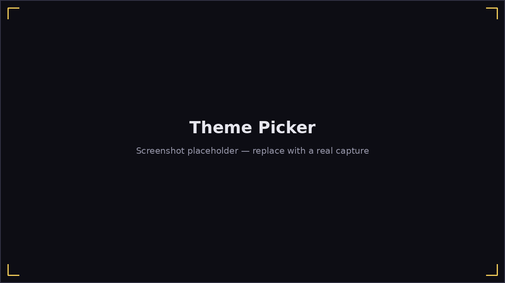

# Themes

**Options → Theme** lets you pick a visual theme for the menus — background
images and button styling/sound effects.

Pick a theme from the list on the left; a preview appears on the right.
Harmonicon ships with a couple of themes out of the box, and reads
additional ones from `~/Harmonicon/themes/` the same way it reads extra
songs (see [Getting Started](getting-started.md#adding-your-own-content))
— drop a theme folder there and it appears in this list without needing to
reinstall anything.

Themes control appearance only: backgrounds, button art, and button sounds/
shader effects. Where every button actually sits on screen is always the
page's own layout, not something a theme can move around — so switching
themes never rearranges a menu, only re-skins it.
