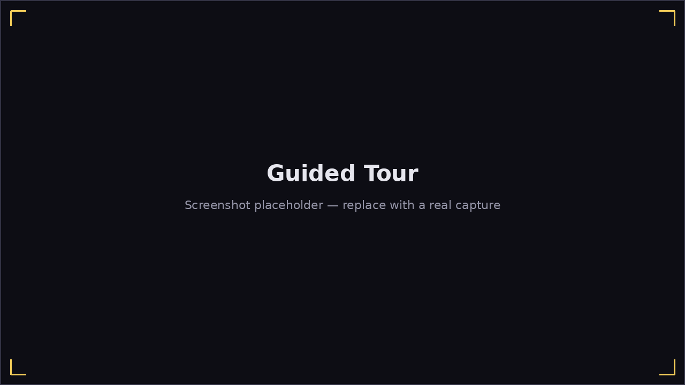

# Guided Tour

**Main Menu → Help / About → Tutorial** is a quick, hands-off tour: click
it and Harmonicon automatically walks through every top-level screen —
including a few seconds of **live play**, not just menu captions — before
returning you right back to where you started:

Main → Play → Select Mode → **a live [Play 2D](play-2d.md) demo** → Jam
Session Menu → **a live [Jam Session](jam-session.md) demo** → [Generate a
Jam](jam-generate.md) → **[Bending Trainer](bending-trainer.md)** →
Lessons → **[Song Editor](song-editor.md)** → Options → Theme →
Help / About → back to where you started.

- A **step counter** ("Step 6 of 13") in the overlay shows your progress
  through the tour.
- Menu steps switch beneath the overlay exactly as if you'd clicked through
  them yourself; the live-play steps actually enter that screen for real —
  the 2D and Jam Session demos briefly play the bundled example song, the
  Bending Trainer and Song Editor steps show those screens exactly as
  you'd see them normally. Either way, the overlay blocks clicks on
  whatever's behind it — you're not meant to interact mid-tour, just watch.
- **Escape does nothing while the tour is running**, on any step —
  including the live-play ones, where it would otherwise pause the game,
  back out of the Bending Trainer, or leave the Song Editor. The demo song
  is long enough that a live-play step never actually finishes on its own;
  the tour always cuts away first, and nothing from a demo step is ever
  saved to your profile.
- Click **Skip Tutorial** at any point — including during a live-play step
  — to end the tour immediately and return to wherever you started it
  from, instead of waiting for the remaining steps.

This is meant as a fast first orientation, not a substitute for the rest of
this book — it covers *what each screen is* (and, for the live-play steps,
a glimpse of what it actually looks like in motion), not *how to use it in
depth*. For that, see the dedicated chapter for whichever screen you want
to know more about (linked from [The Main Menu](main-menu.md)).
